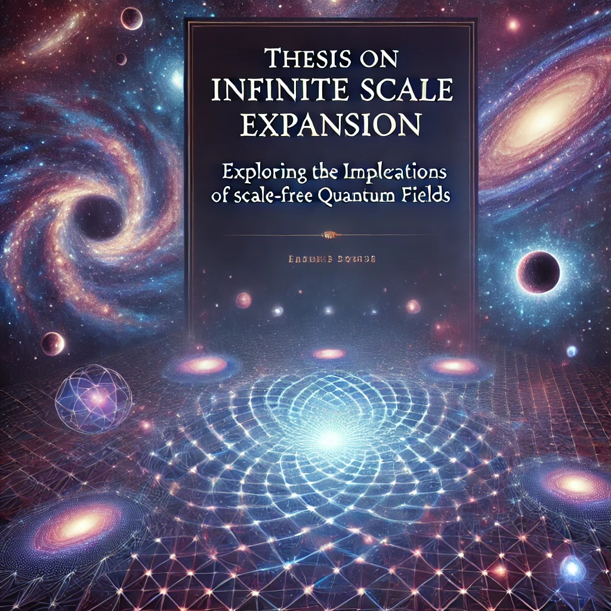

{width=66%}

# Thesis on Infinite Scale Expansion (ISE)
## Exploring the Implications of Scale-Free Quantum Fields

*M.Sc. Physics Gordon Anatta Shaamvai and Colleagues  
Institute of Theoretical Physics, University of Unalaska*

*Infinite Scale Expansion © 2024 by M.Sc. Physics Gordon Anatta Shaamvai is licensed under [CC BY-NC-SA 4.0](https://creativecommons.org/licenses/by-nc-sa/4.0/?ref=chooser-v1)   
To view a copy of this license, visit https://creativecommons.org/licenses/by-nc-sa/4.0/*

---

This work describes the infinite differentiation of scales without fixed principles.

* There are no absolute laws, only observer-relative differences.  
* Structures condense from proto-information, but there is no ultimate truth — only a play of resonances.  
* Each level creates its own reality — yet none is final.

The **most compelling structural feature** of the model is its **radical inversion of the fundamental category of reality**.

### **From Entity to Differentiation as the Origin of All Phenomena**

ISE replaces substance with relation:  
Reality is not made of things, but of **resonant differentials** structured through **continuous scalar differentiation**.

* Space, time, mass, and information do **not pre-exist** but **emerge as projections** along **resonant axes**.

* The world arises not from objects but from **coherence points** within a scale-relative process of unfolding.

* Observation is not external measurement, but **resonant participation** in the very structure from which observation itself emerges.

* There is no outside frame of validation: **reality is scale-relative**, not absolute.

**Reality, is not described – it is the emergent structure of differentiation itself, without background, substrate, or exterior.**

This is not merely epistemologically revolutionary – it is ontologically final:  
 ISE does not refute classical ontology. It **dissolves it into resonance**.

ISE is not a theory in the classical sense but a shift in perspective: the dissolution of any static foundation in favor of a dynamic, scale-dependent reality.

### Scalar Synchronized Differentiation

The concept of "scalar synchronized differentiation" lies at the heart of the framework. This term encapsulates the idea that energy differentiates across all scales in a synchronized manner, where the differentiation at one scale inherently influences and is connected to the differentiation at other scales. This interconnected process creates a cascading network of relationships, where energy at every level of observation contributes to the emergence of structures, phenomena, and interactions.

In essence, scalar synchronized differentiation allows us to conceptualize the universe not as a collection of isolated systems but as an integrated whole. Each differentiation is scalar — it occurs within a particular range of magnitudes — but these differentiations are synchronized, maintaining coherence across scales. For instance, the differentiation that gives rise to quantum fluctuations is inherently connected to the processes that define cosmic structures. This interconnectedness eliminates the need for singularities or independent, disconnected forces, presenting a cohesive vision where all phenomena arise from the same underlying process.

### Dynamic Relation Of Scales

Another fundamental aspect of the model is the "dynamic relation of scales." This concept posits that the universe evolves not through a static framework of space and time but through the continuous interaction and adjustment of scales. As energy differentiates, the relationship between scales adjusts dynamically, enabling the emergence of new dimensions, structures, and causal interactions.

This dynamic interplay ensures that scales are not isolated; rather, they are in constant flux, responding to the differentiation occurring within them. For example, as energy differentiates at smaller scales to create atomic structures, it simultaneously influences larger-scale phenomena such as gravitational fields or galactic formations. This bidirectional flow of influence means that no single scale holds primacy; instead, the universe evolves through the relational adjustments across scales.

By incorporating the dynamic relation of scales, ISE provides a framework that unifies micro- and macroscopic phenomena, offering a lens through which the complex interplay of forces, dimensions, and structures can be understood as a cohesive, evolving system.

## **Key Concepts**

* **Infinite Expansion and Differentiation:** The model proposes that the universe undergoes an ongoing, infinite expansion characterized by continuous differentiation of energy. This differentiation results in the formation of new states of reality, allowing for the dynamic emergence of structures and phenomena over time. In this framework, space, time, and even distance are not fundamental properties but are secondary constructs formed through variations in potential energy. Essentially, the universe evolves by constantly refining energy into distinct levels, which then manifest as the observable dimensions and interactions we perceive. Unlike traditional models that see space and time as given, intrinsic frameworks, ISE views them as byproducts of energy transformations occurring at various scales.  
* **Protoinformation and Quantum Fields:** A central concept of ISE is protoinformation, which represents an undifferentiated state that precedes both space and time. Protoinformation is the fundamental essence from which all differentiated structures emerge, laying the groundwork for observable phenomena in the universe. According to ISE, quantum fields are an extension of protoinformation, but their effects remain largely hidden at smaller scales, only becoming significant as they contribute to larger macroscopic formations. This means that quantum behaviors, typically detectable at subatomic levels, manifest in significant ways as they influence the larger structures of the cosmos. The emergence of quantum fields from protoinformation thus links microscopic and macroscopic realms in a unified process of differentiation.  
* **Cosmological Consequences \- Rethinking Dark Energy and the Big Bang:** The model provides an alternative explanation for dark energy, positioning it as an emergent feature of the differentiation of potential energy, rather than a mysterious, independent force. In this view, dark energy is not an external agent pushing the universe apart, but rather a natural outcome of the way energy differentiates and redistributes itself across expanding scales. This reinterpretation has profound implications for our understanding of cosmic expansion, suggesting that what we observe as accelerating expansion may not require the postulation of a separate form of energy. Additionally, ISE removes the necessity of a singular Big Bang event as the origin of the universe. Instead, the universe is seen as an ever-evolving continuum without an abrupt, singular beginning. The process of differentiation replaces the need for a singularity, allowing the universe to emerge from the continuous unfolding of potential energy without invoking an initial, infinitely dense state.  
* **Fractal Structure and Multiverse Implications:** ISE posits that the universe exhibits a fractal-like structure, meaning that the same fundamental principles of energy differentiation apply at every scale. This fractal nature leads to self-similarity, where similar patterns and processes are seen whether examining galactic formations or subatomic structures. The universe is structured hierarchically, where differentiation creates layers that are interconnected, reflecting a recursive, self-similar design. This fractal framework implies that the processes governing galaxies are akin to those found at the atomic level, offering a unifying perspective that connects vastly different scales of reality. Moreover, ISE suggests the possibility of a multiverse, where each universe is simply a differentiated state within an infinite hierarchy. This means that what we perceive as individual universes might just be iterations or reflections of the same underlying processes, connected in a complex web of energy differentiation.  
* **Emergent Space, Time, and Causality:** In the framework, space and time are emergent phenomena arising from the differentiation of energy. Unlike traditional views where space and time are pre-existing dimensions that form the backdrop of all events, ISE posits that these dimensions come into existence as energy differentiates and interacts. This also means that causality, the link between cause and effect, is not an intrinsic feature of the universe but emerges from relational order within differentiated states. Causality is scale-dependent and is shaped by the observer’s frame of reference and the manner in which energy differentiates. The model suggests that at different levels of differentiation, the flow of time and the perception of causality can vary, resulting in non-linear dynamics that could explain phenomena like the early emergence of complex galaxies.  
* **Eliminating the Need for Singularities:** ISE challenges the necessity of singularities, such as those posited in the Big Bang and black hole models. Instead of conceptualizing these points as infinitely dense and physically paradoxical, the model envisions them as moments where our current understanding and perception of energy fail to represent the true complexity of the differentiation process. Rather than collapsing into singularities, energy undergoes smooth transitions across different scales, meaning that what we perceive as singular points are actually regions of intense differentiation that defy classical descriptions. This view not only removes the problematic nature of singularities but also presents a universe that is perpetually evolving without distinct points of origin or terminal collapse.  
* **The Role of Quantum Effects and Macroscopic Manifestations:** ISE also redefines the role of quantum effects, suggesting that they are not confined to the microscopic world but have macroscopic implications as energy differentiates. At smaller scales, quantum fields interact in ways that are not immediately observable, but as differentiation continues, these interactions culminate in the emergence of complex structures that influence the universe as a whole. This interconnectedness implies that the distinction between quantum and classical worlds is more a matter of scale than of fundamental nature, offering a more integrated view of physics that bridges the gap between the quantum and cosmic scales.  
* **A Holistic Vision for Understanding Reality:** The model offers a comprehensive and potentially revolutionary approach to understanding cosmic evolution, the fundamental forces, and the very nature of reality itself. By shifting away from a model that relies on singularities and fixed spacetime, ISE provides a dynamic, evolving picture of the universe. Everything—from subatomic particles to the largest cosmic structures—is connected through a unified web of energy differentiation. This view not only simplifies our understanding by removing the need for unexplained starting conditions (like a singular Big Bang) but also opens new possibilities for understanding the nature of existence, causality, and the potential for infinite, interconnected realities beyond what we can currently observe.

The model redefines our understanding of the universe by proposing that space, time, and all cosmic structures are emergent properties resulting from continuous energy differentiation. Protoinformation serves as the foundational layer from which observable phenomena arise, linking the quantum and cosmic realms. This model reinterprets dark energy and eliminates the need for singularities, instead presenting an infinitely evolving universe with a fractal-like structure. By viewing time and causality as emergent, scale-dependent properties, ISE provides a holistic and unified approach that challenges traditional boundaries in cosmology, offering a consistent framework for understanding everything from quantum behaviors to the vastness of the multiverse.

## **Resonance in a Dimensionless Quantum Field**

### The Universe as a Resonance Zone

The framework conceptualizes the universe not as a fixed space-time construct, but as a **resonance zone** within a dimensionless quantum field. Rather than existing as a self-contained system, our perceived reality is defined by **stable resonance layers** within an infinitely scalable structure. These layers establish the boundaries of what we experience as physical reality.

### Quantum Mechanics as the Lower Resonance Boundary

* At the smallest observable scales, particles appear **wave-like, probabilistic, and delocalized**, indicating that they are on the **edge of our resonance domain**.  
* **Superposition, entanglement, and quantum fluctuations** suggest that quantum phenomena are manifestations of interactions at a level where **coherent resonance with our reality diminishes**.  
* Quantum uncertainty is a natural result of this **diminishing resonance**, rather than an intrinsic property of nature itself.

### High-Energy Physics as the Upper Resonance Boundary

* Extreme energy densities — such as those found in **black holes, the Planck scale, and the early universe** — push matter and space-time toward the **upper limit of resonance stability**.  
* As energy increases, space-time ceases to behave in a continuous and predictable manner, suggesting a **transition to deeper, higher-order scale structures**.  
* Singularities and event horizons are not absolute boundaries but **transitional zones** where our perception of space-time breaks down due to resonance loss.

### The Role of Resonance in the Perception of Reality

* What we perceive as "physical existence" is a **function of scale-resonant coherence**.  
* Entities and processes that do not interact within our resonance domain remain imperceptible to us, even though they might be fully functional within another resonance layer.  
* This explains why black holes and the quantum vacuum appear to operate under fundamentally different principles — both are points where **our scale of resonance fades into a deeper order**.

### Black Holes and the Big Bang as Resonance Transitions

* **Black holes** may function as gateways to **subquantum scales**, where matter and energy no longer adhere to our familiar space-time structure but instead reorganize into new resonant forms.  
* **The Big Bang** represents a resonance cascade — an emergent differentiation where the universe "cooled" into its current stable resonance state.  
* This suggests that universes may form as **scale-localized resonance phenomena**, rather than absolute singular events.

The ISE perspective redefines reality as a structured resonance field within a dimensionless quantum framework. Our physical universe is **not an isolated entity but a dynamically emergent stability layer**, existing between quantum decoherence at the lower boundary and high-energy dissociation at the upper boundary. Recognizing this framework allows for a deeper understanding of fundamental physics, integrating quantum mechanics, cosmology, and high-energy phenomena into a unified scale-expansive structure.

---

**This detailed analysis provides a conceptual framework for the model without diving into complex mathematical formulations. The emphasis is on its theoretical implications, its potential to explain unresolved cosmological mysteries, and the way it challenges traditional notions of time, space, and causality while preventing narratives.**
