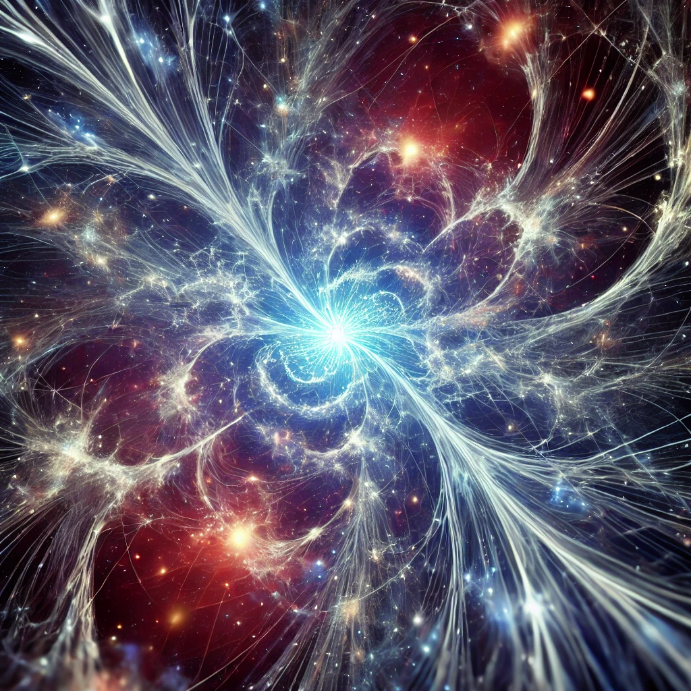

---

# 1\. Introduction

The the model offers an **alternative perspective** to classical cosmological models like the Big Bang. In the theory, **reality is governed by the ongoing differentiation of potential energy**, where the emergence of space, time, and physical forces arises from these differentiations rather than being fundamental aspects of the universe. The theory posits that the universe expands infinitely through **scale differentiation**, rather than through temporal or spatial expansion. This framework provides an **alternative interpretation** that may offer new insights into cosmic evolution.

In this model, **reality is not rooted in a singular event** or a spatial-temporal fabric, but rather in the ongoing differentiation of potential energy. Instead of space, time, and physical forces being intrinsic to the universe, ISE suggests that these **emerge from the process of energy differentiation across scales**.

### Key Features

* **Dynamic Differentiation and Scale Expansion:**  
  The universe under the the framework continuously evolves, not through the stretching of existing space but by **differentiating energy into distinct states**. This process leads to the emergence of new structures and properties, such as gravity and time, at multiple scales. This expansion does not have a spatial or temporal boundary but instead occurs through the ongoing creation of differentiated states, suggesting that the universe may be self-renewing and potentially infinite in scope.  
* **Smooth Energy Transitions, Not Singularities:**  
  Unlike traditional models that require singularities such as black holes or the Big Bang, ISE sees these as simplified constructs resulting from observational limits. **Energy transitions are smooth**, avoiding the need for points of infinite density or breakdowns in physical laws. Instead of singularities, the universe undergoes continuous changes where one state of energy transforms into another seamlessly, providing an alternative to the conventional understanding of cosmic extremities.  
* **Hierarchical Energy Structure Across Scales:**  
  The universe is inherently **hierarchical** in its structure, with energy differentiation taking place at different levels to form new configurations. Each scale, whether microscopic or cosmic, adheres to the same fundamental principles of differentiation, suggesting a **fractal-like structure** where each level may influence and interact with others. This interconnectedness suggests that each part of the universe, from fundamental particles to galactic structures, is a reflection of **energy transformations** happening across multiple dimensions.  
* **Emergence of Relational Properties:**  
  Space, time, and gravity are **emergent**, relational properties within the the framework. Rather than being intrinsic elements of reality, they arise from interactions between differentiated energy states. Space becomes the relational metric between energy differentiations, time is seen as a sequence of these transformations, and gravity emerges as a manifestation of energy relationships across scales. This shifts the focus away from viewing these properties as fundamental entities to understanding them as products of dynamic processes.  
* **No Absolute Beginning or End:**  
  ISE does not require a singular beginning or endpoint for the universe. Instead of a **Big Bang** that marks the start of everything, the universe is understood as existing in a state of constant differentiation. The Big Bang is viewed as just one localized event in an ongoing, infinite process. There is no definitive origin, only continuous transformation and evolution, making this approach a framework that accommodates eternal cosmic evolution.  
* **Fractal and Relational Complexity:**  
  The hierarchical differentiation leads to a **fractal structure** where energy patterns repeat across various scales, providing consistency in complexity from the quantum to the cosmic level. This fractal nature aligns with both quantum mechanics and classical physics, offering a **unifying framework** that links microscopic behaviors with macroscopic phenomena.

These key features illustrate how the the proposed framework diverges fundamentally from traditional cosmological views by **eliminating the need for singularities**, emphasizing relational emergence, and suggesting an eternal process of scale differentiation rather than a finite, temporally bound universe.Departure from the Big Bang Theory

The theory significantly challenges the Big Bang’s depiction of a universe beginning from a **singularity**. In this approach, there is no such "beginning." Rather, the Big Bang is interpreted as a localized event of differentiation—a division of a particle from a larger-scale universe that resulted in the creation of our observable cosmos. The **cosmic microwave background (CMB)**, for instance, is seen not as a relic of the early universe’s singular state, but as an imprint from a previous evolutionary phase when the universe’s scale was smaller.

### Philosophical Implications

ISE offers a perspective that could change our understanding of reality. In a universe where **space and time are emergent phenomena** rather than fundamental, the need for a creation event—a singular origin like the Big Bang—is rendered unnecessary. Instead, the universe is viewed as a dynamic, self-regulating system of energy flows that constantly evolve, forming new structures and states without the need for a predefined narrative of creation or end.

### Framework for Understanding Cosmic Evolution

Instead of an expanding space filled with matter, the model speaks to expansion as the **differentiation of energy**. This continuous process replaces the traditional view of an inflating universe, suggesting instead that new states of reality emerge through the interaction of energy fields that exist at all scales.

### Typical Questions and the model's Answers

* **How does ISE describe the nature of space and time?**  
  Space and time are not fundamental entities but are emergent properties arising from energy differentiation. They emerge as relationships between different states of energy rather than existing as independent constructs.  
* **What is the role of energy differentiation in cosmic evolution?**  
  Energy differentiation is the central mechanism behind the universe's evolution. It is a continuous process that leads to the emergence of all cosmic phenomena, including space, time, and gravity, without a need for a singular beginning or endpoint.  
* **How does ISE view cosmological observations like black holes and the CMB?**  
  Black holes and the cosmic microwave background (CMB) are interpreted as manifestations of energy differentiation at different scales. Black holes represent regions of intense differentiation rather than singularities, while the CMB is seen as a remnant of past differentiation phases, not as a relic of a singular origin.  
* **Is there an ultimate beginning or end to the universe?**  
  No. The theory posits that the universe exists in a perpetual state of differentiation without a definitive beginning or end. This infinite process removes the necessity for a singular creation event or an ultimate termination.  
* **How does gravity emerge in the framework?**  
  Gravity is viewed as an emergent effect of the differentiation of energy across scales. It is not a fundamental force but arises naturally from the relationships and interactions of differentiated energy states, offering a potential new perspective on gravitational interactions.

### Philosophical Openness

The model offers an open approach that encourages creativity and new ways of thinking about the universe. By focusing on the **continuous differentiation of energy**, the theory moves away from the complexities and paradoxes of traditional cosmological theories, replacing them with an adaptable concept of reality’s emergence. The goal of this approach is not to provide definitive answers but to provoke thought and foster new perspectives, allowing exploration beyond the limits of established physics.

### Relativ Relativity

The model extends the principles of relativity found in both Einstein's special and general theories, taking them to their logical conclusion. While relativity revolutionized our understanding of time, space, and gravity by demonstrating that they are not absolute but instead depend on the observer’s frame of reference, the theory goes further by proposing that **space and time themselves are not fundamental properties** of the universe.

In Einstein's relativity, the fabric of spacetime bends in response to energy and mass, defining gravitational forces. the model advances this idea by suggesting that spacetime itself emerges from more fundamental energy differentiations within a scale-free quantum field. This means that spacetime, and the forces within it, are **emergent properties**—not pre-existing, but formed by changes in potential energy over various scales.

While general relativity interprets gravity as the curvature of spacetime, the framework argues that **gravity is an emergent feature** that arises from the differentiation of potential energy states across different scales of existence. In this sense, ISE logically extends relativity by challenging the notion that the fabric of spacetime is a given entity and positing instead that it is a consequence of deeper, more fundamental processes.

### Singularities

In the model, singularities are not excluded. Instead, they are understood as **relative phenomena** that depend on the observer’s scale. From one particular scale, a singularity might appear as a point of infinite density or an undifferentiated state, such as the case with black holes or the Big Bang. However, from another scale, what appears as a singularity could be seen as a fully differentiated system or even an entire universe in its own right.

In the framework, the perception of singularities is **scale-dependent**. While a singularity may seem like a breakdown of physical laws at a certain level of observation, from a different perspective or scale, there is no such collapse—just a shift in the way energy is differentiated. Therefore, singularities are relative constructs, observed differently depending on the scale of differentiation and not inherent, fundamental breakdowns of the universe.

### Reductionist Approach to Particles and Information

In this context, a reductionist approach to particles and information can be understood as breaking down complex phenomena into their simplest components, while an instrumentalist and minimalist theory aims to describe reality with the fewest possible assumptions, focusing on **observable and practical outcomes** rather than metaphysical speculation.

Reductionism typically seeks to explain complex systems by reducing them to their most basic elements, such as particles or forces. Particles aren’t fundamental building blocks of reality but **emergent states** that arise from the continuous differentiation of potential energy. According to ISE, what we observe as particles are simply aggregates of differentiated energy in specific configurations. Thus, the "particles" themselves do not exist independently of the process of differentiation; they are merely manifestations of the underlying field of energy at a given scale.

* Information, in this view, is not a fundamental entity either. It is the result of the process of differentiation—the way energy splits into different states or configurations. Information, like particles, is a byproduct of **energy differentiating** into measurable or observable forms. Therefore, what we describe as "information" is simply how we understand or organize these energy states relative to each other.

### Instrumentalism and Minimalism

In an instrumentalist view, theories and models are judged based on how useful they are for predicting or explaining phenomena, rather than their reflection of any deeper "reality." ISE fits within this instrumentalist paradigm by not trying to provide an absolute explanation for the universe's nature but rather focusing on how **emergent properties** (like space, time, particles, and forces) can be described through **energy differentiation**.

* Minimalism refers to the rejection of **unnecessary complexity**. Instead of invoking new particles, forces, or dimensions to explain phenomena like dark energy, ISE minimizes assumptions by suggesting that all observed phenomena emerge from the same process of **differentiation**. There is no need for extra metaphysical entities; the universe is simply the continuous division and reorganization of energy into different states.

In this sense, ISE is both reductionist (in that it breaks everything down to differentiations of energy) and instrumentalist (in that it focuses on what can be observed and described, not on unobservable metaphysical claims). Particles and information are not the fundamental constituents of reality but are expressions of **differentiated energy** that help us make sense of the universe within a **minimalist and pragmatic framework**.

### Openness

The model offers a **free approach** that allows readers to engage with a realm of physics that has often become tangled in contradictions, myths, and rigid theories. It is designed to be **accessible** regardless of one’s prior knowledge or background, freeing the mind from the **constraints of traditional frameworks**.

This approach does not demand allegiance to established cosmological or quantum models, nor does it rely on a particular **scientific dogma**. Instead, it encourages **creativity** and invites **new ways of thinking** about the universe. By focusing on the **continuous differentiation of energy**, the framework deliberately moves away from the complexities and paradoxes of modern physics—such as **dark energy, singularities**, and the **fine-tuning** of the universe—replacing them with a more **open-ended and adaptable concept** of reality’s emergence.

The primary goal of this theory is not to provide definitive answers but to **provoke thought** and foster **new perspectives**. It seeks to **ignite imagination** and **critical reflection**, encouraging readers to explore **alternative explanations** for **space, time, and matter**. By doing so, it invites exploration into the **creative and speculative territories** of physics, a space where **contradictions can coexist** with new insights and where **previously accepted boundaries** can be reconsidered.

This **freedom of interpretation** is vital because it allows for **fresh entry points** into physics, unhindered by the **weight of traditional theory**. Readers are encouraged to approach this with an **open mind**, recognizing that the model is less about providing a **finished solution** and more about **stimulating further inquiry** and **questioning the limits** of current scientific understanding.

The concept effectively demonstrates, even through examples, that we are capable of imagining the **infinite and the impossible**. It challenges the **conventional notion of singularities** by proposing that they are not **finite points** but rather **contradictory states**—places where the **laws of physics** as we understand them **break down**, not because they reach an ultimate end, but because they enter realms of **inconsistency or paradox**.

In this framework, **existence itself** is not bound by the need for creation or an origin. Instead of relying on a **singular event** like the **Big Bang** to mark the beginning of time and space, it suggests that the **universe** is in a **constant state of differentiation**—an **unceasing process** where energy unfolds and reconfigures without a definite starting point. This view **liberates existence** from the **constraints of a linear beginning** or a finite creation event, positioning it as something that simply is—a **process without origin or end**.

By embracing the **impossible and the infinite**, the theory **pushes the boundaries** of what we consider real or conceivable. It offers a perspective where **existence can be eternal and self-sustaining**, not requiring a moment of creation or a predetermined trajectory. In doing so, it encourages us to **think beyond the limitations** of classical physics and to **reimagine the nature** of the universe in a way that accommodates both **paradox and infinite complexity**.

### About the Main Author

**Gordon Annata Shaamvai** is a theoretical physicist with a particular focus on the fundamental structures of the universe. Currently, I am working at the **Institute of Theoretical Physics, University of Unalaska**, where I explore questions related to cosmological dynamics and the structuring of space and time across various scales. My research interests lie particularly in investigating processes that extend beyond established theoretical models and open new perspectives on the laws of nature.

I was born into a modest family with a strong spiritual background. From an early age, I asked fundamental questions about the nature of reality, which led me to question and deconstruct existing concepts. My parents nurtured my curiosity for knowledge, but financial constraints made access to formal education difficult. Through fortunate circumstances and the support of various scholarships, I was able to pursue an academic career and deepen my studies in theoretical physics.

My academic journey led me through various institutions where I engaged with complex systems, asymptotic structures, and the mathematical description of reality. Through my work on a consistent expansion of classical concepts, I have developed an approach that allows for a reinterpretation of fundamental mechanisms and their integration into a coherent framework.

During my time in Unalaska, I have worked on a structural examination of scale differentiation, which provides deeper insights into the continuous transitions between observable and non-directly accessible layers of reality. My approach combines mathematical rigor with an open methodological perspective that extends the theoretical framework beyond conventional paradigms.

The development of my research has often progressed independently of conventional academic structures, yet my work has gained recognition in various scholarly circles. The theoretical concepts I explore are based on the idea that the dynamics of systems cannot be fully explained by known principles alone but are subject to a broader order that can only be revealed through a more comprehensive examination of interrelations.

My current project focuses on advancing these concepts and their mathematical formalization, with the aim of establishing a coherent theoretical foundation that reconciles different scales of physical reality. The nature of our cognitive processes is itself part of this research, as every theoretical development also serves as a point of reflection for the methodology of scientific thought.
