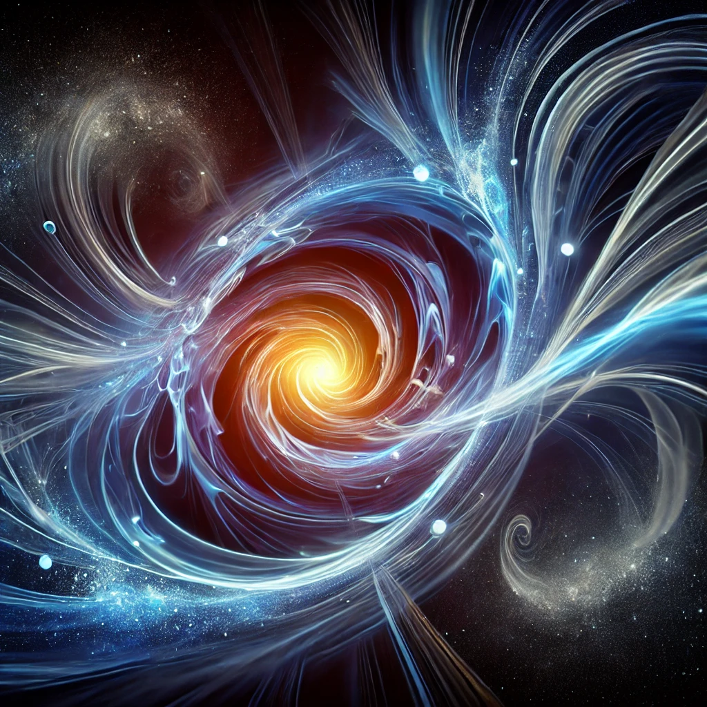

---

{width=66%}

# 2\. Emergence of Space, Time, and Gravity

In classical mechanics, gravity is seen as a fundamental force; however, the model sees it as an emergent property of energy differentiation. Distances between objects, gravitational effects, and even time emerge from the relationship between differentiated energy states within a scale-free quantum field. This marks a departure from the traditional gravitational models and time as an inherent dimension, suggesting that time itself is born from changes in potential energy over different scales.

This model also implies that at scales below the Planck length, no distinguishable spacetime exists. Space and time, according to ISE, are perceived only when sufficient differentiation has occurred. Sub-Planck level Time concepts can be interpreted as energy niveau.

Emergence of Space, Time, and Gravity

* **Space and Gravity as Emergent Properties**:  
  Gravity is not a fundamental force as described in classical mechanics but an emergent property resulting from potential energy differentiation across scales. Space and distance emerge similarly, implying that at scales below the Planck length, no distinguishable spacetime exists. The notion of a flat or curved universe is adaptable, as the theory allows the application of its principles to spaces with any curvature — positive, negative, or neutral​​.  
* **Time as a Differentiation of Scale**:  
  Time, within the framework, is not a constant flowing dimension but the result of changing energy states. It evolves as potential energy differentiates, and its flow is dictated by this scale evolution. Time, thus, doesn't exist independently but emerges as an artifact of scale differentiation​​ or at least our experience of it.  
* **Planck Scale and the Non-Existence of Classical Space**:  
  Below the Planck length, spacetime is undifferentiated and non-existent in the classical sense. Space and time as perceived phenomena only emerge when energy differentiates beyond a certain scale. This leads to the understanding that spacetime itself is a byproduct of energy distribution, and at quantum levels, space and time dissolve into a unified energy potential​​.  
* **Potential Energy and Gravity**:  
  Potential energy drives the creation of what we perceive as gravitational forces. As energy differentiates, distances and gravitational effects emerge as secondary properties. In regions with higher energy concentrations, gravity manifests strongly, while in lower concentrations, spacetime appears "flatter" or less curved. This suggests that gravity and spacetime are intertwined consequences of energy differentiation​​.  
* **Challenges to Traditional Relativity**:  
  Classical models, including Einstein's relativity, describe gravity as the curvature of spacetime. ISE reinterprets this, suggesting that spacetime curvature is an emergent phenomenon rather than a fundamental attribute of the universe. Gravity is thus not a force acting on spacetime but a result of energy flows across scales​.  
* **Quantum Fluctuations and Spacetime**:  
  Quantum fields and fluctuations, according to ISE, cannot expand in the way classical spacetime expands because they do not inherently "contain" space. These quantum effects, originating from protoinformation, lead to observable macroscopic structures but remain unaffected by the traditional understanding of an expanding universe. Instead, spacetime emerges at scales large enough for quantum fluctuations to normalize​​.  
* **Implications for Black Holes and Singularities**:  
  ISE eliminates the need for singularities like those proposed in black holes or the Big Bang. Black holes, rather than collapsing into singularities, become regions where energy differentiates minimally. Spacetime does not break down into infinities, but smoothly transitions through energy redistribution​​.  
* **Philosophical Questions on Reality**:  
  ISE challenges the perception of space and time as "real" dimensions. Instead, they are emergent from a deeper, undifferentiated energy state. This approach suggests that what we observe as space, time, and gravity are merely outcomes of energy differentiations and not absolute features of the universe​.

These elements provide a comprehensive exploration of space, time, and gravity as emergent phenomena, focusing on how energy differentiations replace the traditional framework of fundamental forces and dimensions.
