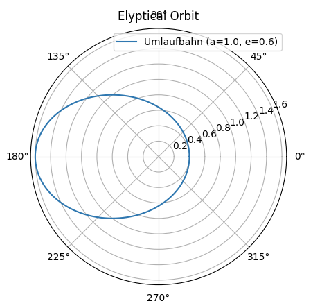
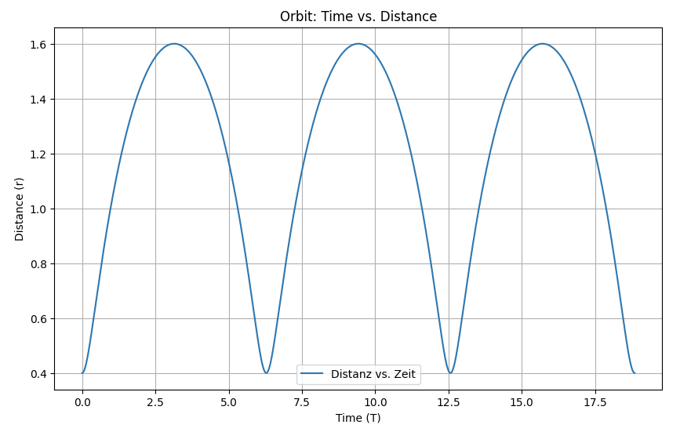
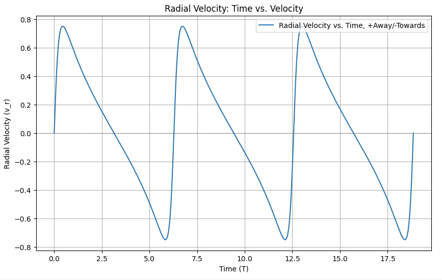
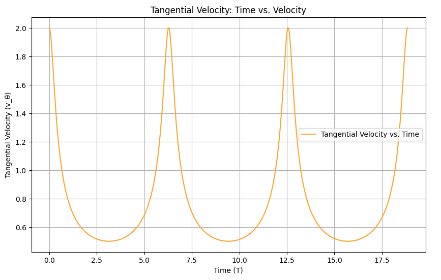
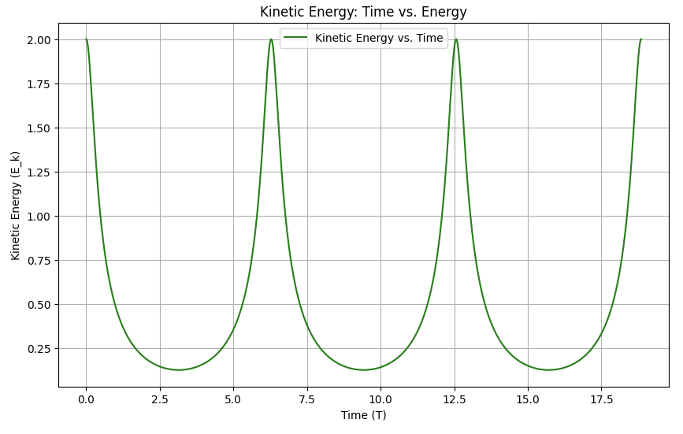
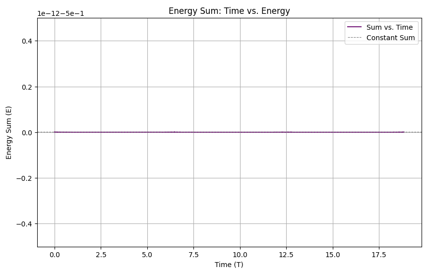

---

## **2.6. Euclidean Geometry and Space Curvature**

In the context of framework**)**, every anomaly in Euclidean geometry can be understood as a result of potential energy vectors and interpreted as **space curvature**. Here's an explanation of how this works:

In classical Euclidean geometry, space is flat, with parallel lines that never meet and constant distances between points. However, its proposed that **space is not a fundamental backdrop** but an emergent property of the differentiation of potential energy.

* In other words, space forms as a result of how potential energy **organizes itself**. When potential vectors (representing energy) are perfectly aligned and balanced, the geometry behaves as Euclidean.

**Potential Vectors and Their Role**

In ISE, **potential vectors** represent the directional influence of energy states. These vectors shape how distances and positions are perceived in the emergent space. When potential vectors are balanced across a region, space appears flat and behaves according to the rules of Euclidean geometry.

* However, **anomalies** in these potential vectors — such as imbalances or deviations — create disturbances in this flat geometry.

**Anomalies as Space Curvature**

An anomaly in the distribution of potential vectors can be thought of as **a disturbance in the energy balance**. These disturbances **warp or curve** the space that emerges from those vectors, leading to **curved space** as seen in General Relativity.

* In simple terms, any time the potential vectors deviate from the ideal, perfectly aligned Euclidean configuration, the result is **space curvature**. The more significant the anomaly, the more pronounced the curvature.

**Interpreting Curvature**

The concept of **curvature** isn't tied to an external force or spacetime fabric. Instead, it results directly from the **distribution and dynamics of potential energy**. This means that what we interpret as space curvature in classical physics (as described by General Relativity) is, in fact, a manifestation of these vector anomalies.

* Space curvature is therefore not a pre-existing condition but a **byproduct of how potential energy differentiates**.

**Practical Example**

Take the curvature around a massive object like a planet. In General Relativity, this is interpreted as spacetime bending around the mass due to its gravity. In the framework, this curvature is instead understood as the result of **potential energy vectors** being concentrated and misaligned around the mass. This creates the **appearance of curved space**, but it is fundamentally an effect of energy distribution rather than spacetime geometry itself.

**Conclusion**

Any anomaly in the perfect flatness of Euclidean geometry — whether caused by mass, energy concentration, or other factors — can be interpreted as **curvature of space**, but this curvature arises from **potential energy vectors** rather than an intrinsic property of space.

### The One-Dimensional Universe and the Transition to N-Dimensionality

The thesis posits that the universe is fundamentally N-dimensional, where N corresponds to the quantifiable relational information inherent in the cosmos. This principle aligns with the consequences of curved spacetime in Einstein’s General Theory of Relativity, which shows that the universe cannot be fully described using only three spatial dimensions. The ISE extends this notion by asserting that dimensionality itself is not absolute but emergent from the relational structure of reality.

To convey this concept, let us begin with a simplified thought experiment of a **one-dimensional (1D) universe** and gradually expand the framework to higher dimensions, culminating in the N-dimensional view proposed by the ISE. This progression offers a pathway to reframe classical interpretations and illustrates how apparent dimensional complexity arises from the interplay of relational factors.

**1D Universe: Singularities and Radial Dynamics**

In a strictly 1D universe, only one spatial parameter exists: a radial coordinate . Motion is purely radial; there are no angular or tangential components as no perpendicular directions exist. This simplicity allows us to examine dynamics at their most fundamental level.

Consider a gravitational interaction in this 1D universe. Any energy associated with tangential motion in a 3D model must be reinterpreted in 1D. Here, **tangential energy does not vanish** but instead manifests as a modification of the radial coordinate — a stretching or contraction of space itself. This deformation can be thought of as analogous to the frame-dragging effect observed in General Relativity, where rotational energy is embedded in the curvature of spacetime.

At singularities, such as those at the core of black holes or during the initial conditions of the Big Bang, energy associated with tangential motion becomes entirely bound in the structure of spacetime. In the ISE interpretation, this signifies that the universe, at such extremes, collapses to a state of effective 1D structure, where all dynamics are reducible to variations in the radial coordinate and its associated space-stretching effects.

**Frame-Dragging as a 1D Representation**

In curved spacetime, rotating masses induce frame-dragging, where the surrounding space is "dragged along" with the rotation. This phenomenon illustrates how energy that would be interpreted as angular momentum in 3D is encoded in spacetime geometry.

In the 1D framework of the ISE, tangential energy does not "disappear" but is instead incorporated into the stretching or compression of the radial coordinate. This approach reveals that energy is conserved not by invoking additional spatial dimensions but by recognizing that the 1D geometry itself evolves dynamically in response to relational changes. In this view, the radial velocity and effective spatial distortion together account for the energy that would otherwise be attributed to tangential components.

**From 1D to 3D: Classical Emergence**

Expanding from a 1D universe to a 3D framework, we observe the emergence of tangential motion and angular components. In classical mechanics, this is described by the division of motion into radial and tangential velocities. Tangential velocity contributes to the orbital motion observed in gravitational systems, such as planetary orbits.

However, the ISE highlights that even in a 3D representation, the sum of all potential interactions in the universe does not adhere strictly to Euclidean geometry. Angular deficits and other geometric anomalies observed in large-scale structures or around massive objects (e.g., gravitational lensing) reflect the underlying N-dimensional relational structure of the universe.

**N-Dimensional Universe: Relations as Dimensions**

The framework extends beyond classical 3D and even 4D spacetime by proposing that the universe’s true dimensionality is N, where N corresponds to the total number of independent relational degrees of freedom. Each object in the universe has a potential relationship with every other object, generating a network of interactions. The ISE suggests that these relational potentials form the fundamental "dimensions" of reality.

For example:

* In 1D, relational dynamics are purely radial, with tangential energy encoded in distortions of the radial coordinate.  
* In 3D, tangential motion emerges, but the system remains a projection of higher relational interactions.  
* In N-D, each relational potential contributes to the universe’s geometry, with no absolute spatial dimensions, only a web of interrelations.

**Singularities and Dimensional Reduction**

At singularities, such as the Big Bang or within black holes, the apparent dimensionality of the universe reduces to a minimum. The ISE interprets this not as a loss of dimensions but as the full encoding of relational information into a single radial parameter. The distortion of spacetime — frame-dragging, stretching, or contraction — captures what would otherwise be described as multidimensional effects.

This conceptual shift allows the ISE to describe phenomena like the faster-than-light expansion of space (e.g., during cosmic inflation) without violating causality. In a 1D framework, such expansion is understood as a dynamic stretching of the radial coordinate, eliminating the need for classical tangential motion entirely.

**Conclusion**

The transition from 1D to 3D and ultimately to N-dimensionality demonstrates how the ISE reframes classical interpretations of motion, energy, and space. By viewing dimensionality as emergent from relational potentials, the ISE offers a precise yet expansive model of the universe. Tangential motion, rather than being a fundamental phenomenon, is revealed as a projection of radial distortions and relational dynamics within a highly interconnected N-dimensional framework.

**Example of a Simple Orbit Between Two Objects**

This section examines the dynamics of a simple orbital system between two objects. By analyzing their motion, we can gain insight into the interplay between distance, velocity, and energy. Such analysis serves as a foundational model for understanding more complex systems like those explored in the model.

|  |  |
| :---- | :---- |

**Distance Over Time**

The variation of distance between two objects is relevant in both 1D and 3D contexts. This distance is a critical component of the potential energy vector used in ISE. Understanding how distance evolves provides a basis for determining the gravitational and energetic interactions between the objects.

|  |  |
| :---- | :---- |

**Radial and Tangential Components**

The velocity of an orbiting object can be broken down into radial and tangential components. The radial velocity reflects motion directly toward or away from the central object, while the tangential velocity represents the perpendicular motion. Together, these components provide a complete picture of the object's dynamic state in orbit.

|  |  |
| :---- | :---- |

**Combination of Velocity Elements in One Dimension**

By combining radial and tangential velocities, we can calculate the total kinetic energy in a one-dimensional representation. In the framework, this combination forms the second component of the potential energy vector. This integration helps illustrate how motion contributes to the system's overall energy.

|  |  |
| :---- | :---- |

**Summing Energies for Verification**

To ensure consistency, the total energy is calculated as the sum of kinetic and potential energies. In a closed orbital system, this total energy remains constant over time. This serves as a crucial validation point when modeling systems within the framework, reinforcing the principle of energy conservation.

|  |  |
| :---- | :---- |

**The Equivalence of Tangential Energy in a 1D Universe**

In the framework, the treatment of tangential energy in a 1D universe reveals a fundamental property of energy distribution: in a single-dimensional system, tangential energy becomes indistinguishable from energy associated with radial velocity or distance. This insight simplifies the representation of energy relationships in 1D, as it eliminates the need to differentiate between these components.

**Tangential Energy in a 1D Universe**

In a traditional 3D space, tangential energy is tied to motion orthogonal to the radial vector. However, in a 1D universe, there is no orthogonal direction, and all motion and energy contributions collapse onto the single available axis. Tangential energy, rather than disappearing, is absorbed entirely into the single-dimensional system. As a result, it manifests as part of the total energy distributed along the radial axis.

**Equivalence in Representation**

Given this collapse of dimensionality, tangential energy can be equally:

* **Added to radial velocity**:  
  * In this representation, tangential energy contributes to the kinetic energy along the single axis of motion. It modifies the total radial velocity, effectively treating the tangential component as part of the kinetic dynamics of the system.  
* **Correlated with distance**:  
  * Alternatively, tangential energy can be viewed as influencing the energy contribution tied to the separation between objects. In this case, it is represented as part of the spatial energy, emphasizing its role in maintaining the separation of objects in the system.

The choice between these two representations is mathematically equivalent in 1D. Both approaches describe the same energetic state, as all energy in a 1D system ultimately contributes to the single axis of motion or separation.

**Graphical Implications**

This equivalence has practical consequences for the visualization of energy in 1D systems. If tangential energy is added to radial velocity, the resulting graphs emphasize the role of kinetic energy in the system. Conversely, if tangential energy is tied to distance, the focus shifts to spatial relationships. Importantly, the physical interpretation remains unchanged, as both approaches describe the same energy redistribution in the 1D framework.

**Relevance**

The framework embraces this flexibility in representation, demonstrating that energy distribution is not bound to a specific parameter but rather adapts to the dimensional constraints of the system. In a 1D universe, this adaptability reflects the collapse of independent energy components into a unified axis, reaffirming the linearity of energy relationships in this context.

**Conclusion**

In the 1D universe modeled by ISE, the tangential energy is inherently unified with radial energy, whether represented through velocity or distance. This equivalence provides freedom in modeling and visualization while maintaining consistency in the underlying energy framework. The flexibility underscores the ISE principle that energy relationships transcend specific spatial configurations and remain fundamentally linear in isolated systems.

### The Emergence of Spatiality and Differentiation Through Transformation

The transformation of tangential energy into a single-dimensional framework within the ISE offers a profound insight: the unification of energy components along a single axis is a potential **precursor to spatial differentiation**. This transformation highlights how the emergence of multidimensional space might be rooted in more fundamental energy relationships that remain linear at their core.

**From Unidimensional to Multidimensional Systems**

In a 1D universe, tangential and radial energies collapse into a single axis, erasing any directional distinction. This collapse represents a state of fundamental simplicity where energy relationships are strictly linear. However, as dimensionality emerges, the differentiation of energy into tangential and radial components signals the **onset of spatiality**. The following steps can be observed:

* **Unified Energy Relationships in 1D:**  
  In a single dimension, energy is described entirely through linear relationships. Tangential energy loses its distinct identity and merges seamlessly with radial energy or distance.  
* **Differentiation in Higher Dimensions:**  
  As spatiality emerges, the system's energy differentiates into orthogonal components (radial and tangential). These components allow for the formation of complex trajectories, making space itself a derivative construct of the underlying energy relationships.  
* **The Role of Transformation in Emergence:**  
  The process of reintroducing tangential energy as a separate component in higher dimensions underscores the role of transformation in the emergence of spatiality. This differentiation enables the interactions and motions that give rise to the observable complexity of multidimensional systems.

Thus, the transition from linear, unified energy relationships in 1D to differentiated, multidimensional systems serves as a blueprint for understanding how **spatial dimensions emerge** as a natural consequence of energy redistribution.

**Towards a Limited Analytical Solution for the N-Body Problem**

The N-body problem is famously nonlinear and chaotic in classical mechanics, particularly in multidimensional settings. However, by reducing the problem to **N independent linear relationships** in 1D, the framework suggests the possibility of a **limited analytical solution** under certain constraints.

**Linearizing the N-Body Problem**

In the ISE approach, the interactions between N bodies are not treated as a coupled, nonlinear system but rather as a set of **pairwise energy relationships**:

* Each body has a unique energy relationship with every other body, characterized by their separation energy (or the energy required to separate them to infinity).  
* These relationships are **linear** as long as they are considered independently, avoiding the chaotic mixing of spatial trajectories.  
* This reduction to N linear equations transforms the system into a manageable framework that can be solved analytically for many configurations.

**Emergent Spatiality and Analytical Insight**

By reducing the N-body problem to its energy components and treating these as linear relationships, the framework provides a unique lens for understanding:

* **The Emergence of Complexity:**  
  The differentiation of energy relationships from 1D to higher dimensions offers a direct link between fundamental linearity and the observable chaos of multidimensional systems.  
* **The Potential for Analytical Solutions:**  
  While a fully general solution to the N-body problem remains elusive, the framework opens the door to **limited analytical solutions** for specific cases by focusing on energy redistribution rather than direct spatial interactions.

This approach bridges the gap between the simplicity of linear energy relationships and the complexity of multidimensional motion, offering both theoretical and practical insights into the nature of spatiality and the dynamics of N-body systems.

**The ISE Explanation of Orbital Dynamics**

In the framework, the apparent motion of a planet around a star is not the result of continuous force interactions, as described in classical mechanics, but rather an emergent phenomenon of **energy equilibrium**. This challenges the traditional view by reframing orbits as outcomes of stable energy distributions, rather than force-driven dynamics.

**The Role of Energy in Separation**

According to ISE, the initial separation between the planet and the star is the result of a **one-time energy expenditure**. This energy established the distance between the two bodies and created a stable energetic relationship:

* The **potential vector** defines this energy relationship. It combines the energy needed to separate the bodies with their current relative positions.  
* The energy remains conserved and stable, manifesting as a balance within the potential vector.

In this view, **no continuous gravitational force is acting**, and the system maintains itself without any need for ongoing input.

**Oscillation Between Speed and Distance**

The ISE posits that the apparent motion of the planet is not a physical "orbit" in the classical sense but rather a **pendulum-like oscillation** within the potential vector:

* The potential vector oscillates between two manifestations of energy: **kinetic energy** (speed) and **spatial energy** (distance).  
* This oscillation creates the appearance of a planet moving in a closed path, but fundamentally, it is a redistribution of the energy within the system, not a result of external forces.

**Emergence of Elliptical Orbits in 3D**

Through further layers of **emergence**, this oscillation in the potential vector translates into what we observe as **elliptical orbits** in a 3D space:

* The pendulum-like behavior becomes a more complex motion due to the introduction of additional degrees of freedom (spatial dimensionality).  
* Elliptical orbits emerge naturally as a stable pattern resulting from the energy dynamics of the potential vector, without requiring any concept of gravitational force.

This emergent behavior aligns with the observations of classical mechanics but provides a deeper explanation: **the orbit is not driven by forces but is a higher-order manifestation of stable energy distributions**.

**ISE vs. Classical Physics**

* **Classical View (Forces and Trajectories):**  
  * Planets orbit stars due to the balance of gravitational force and inertia.  
  * Elliptical orbits arise from the coupling of radial and tangential motions, driven by the gravitational force.  
* **ISE View (Energy and Emergence):**  
  * Planets do not "orbit" in the traditional sense; the observed motion is the emergent result of a stable potential vector oscillating between energy states.  
  * Elliptical orbits are not trajectories determined by forces but the outcome of energy redistribution in a multidimensional system.

**Implications of the ISE Perspective**

* **No Forces Required:**  
  The ISE eliminates the need for continuous force interactions (e.g., gravity) to explain orbital motion, relying instead on stable energy levels.  
* **Energy-Based Simplicity:**  
  By framing the problem in terms of conserved energy states, the ISE simplifies the understanding of motion, focusing on **energy transformations** rather than force dynamics.  
* **Emergence as a Fundamental Principle:**  
  The elliptical orbits observed in 3D are not imposed by physical forces but arise naturally as a higher-order emergent property of the energy relationships in the system.

The ISE approach offers a fundamentally different explanation for the apparent motion of planets around stars. By attributing this motion to stable energy levels in the potential vector, oscillating between speed and distance, it reframes orbital dynamics as an emergent property of energy distribution. This perspective eliminates the need for force-based interactions, providing a compelling, energy-centric framework for understanding the universe.

**Incorporating Relativity: Straight Trajectories Through Curved Spacetime**

The framework aligns intriguingly with aspects of Einstein’s General Theory of Relativity, particularly in its reinterpretation of motion in gravitational fields. Relativity provides a model where objects follow **straight trajectories (geodesics)** in a **curved spacetime**, while the ISE reframes orbital motion as an emergent property of stable energy distributions. Together, these perspectives converge to offer a profound understanding of planetary motion.

**Relativity: Straight Lines in Curved Spacetime**

In Einstein's General Relativity, gravity is not a force but the result of spacetime curvature:

* Massive objects, such as stars, distort spacetime around them.  
* Planets and other objects move along **geodesics** — the straightest possible paths — in this curved spacetime.  
* The appearance of orbital motion is a consequence of the planet's geodesic intersecting repeatedly with the curved spacetime around the star.

The curvature of spacetime replaces the classical idea of gravitational force, creating a natural trajectory that planets follow without requiring a pulling or pushing force. This concept challenges the Newtonian picture of a force-driven orbit and resonates with the ISE's emphasis on energy rather than forces.

**ISE’s Stable Energy Distribution and Spacetime Curvature**

The framework introduces a complementary layer of explanation:

* While Relativity attributes motion to spacetime curvature, the ISE focuses on the **stable energy levels** that exist between objects in the system.  
* The **potential vector** represents an equilibrium of energy, oscillating between kinetic and spatial components. This energy oscillation naturally creates what appears as an orbital trajectory when viewed in emergent spatial dimensions.

In the relativistic picture, the curvature of spacetime ensures the geodesic path is stable, while in the ISE picture, the energy stability ensures that the system remains in equilibrium. Both frameworks describe the same phenomenon but from different perspectives:

* **Relativity**: Spacetime geometry dictates the trajectory.  
* **ISE**: Energy dynamics create the emergent trajectory.

**Reframing Orbital Motion: No Forces Required**

When combining these perspectives, the traditional notion of "forces" becomes obsolete:

* **In Relativity**: The planet is not "pulled" by the star but follows a geodesic path shaped by spacetime curvature.  
* **In ISE**: The planet's motion is not driven by forces but emerges from the redistribution of energy within the system’s potential vector.

Both views eliminate the need for continuous force interactions:

* In Relativity, gravity is the manifestation of spacetime curvature.  
* In ISE, motion arises from oscillations within a stable energy system.

**Elliptical Orbits as Emergent Trajectories**

The elliptical orbits observed in 3D space are a natural outcome in both frameworks:

* In Relativity, the curvature of spacetime around a star creates closed geodesics for objects within specific energy ranges, resulting in elliptical orbits.  
* In ISE, the oscillation of energy between kinetic and spatial components in a multidimensional system produces elliptical trajectories as a higher-order emergent property.

Both approaches describe the same observed behavior but from fundamentally different foundations:

* Relativity focuses on the **geometrical structure of spacetime**, while  
* ISE focuses on the **energetic structure of the system**.

**The Convergence of Relativity and ISE**

The integration of Relativity into the framework offers a unified perspective:

* **Geodesics in Relativity** can be seen as the spacetime manifestation of the ISE’s stable potential vector.  
* The oscillation of energy in the framework provides an underlying explanation for why objects follow stable geodesics: they reflect the equilibrium of energy in the system.  
* Both frameworks emphasize that planetary motion is **not force-driven** but rather an emergent property of underlying structures — spatial in Relativity, energetic in ISE.

**A View on Orbital Dynamics**

By combining Relativity and ISE, a more comprehensive understanding of planetary motion emerges:

* Relativity describes how spacetime curvature guides objects along straight geodesics in a curved geometry.  
* ISE explains how stable energy distributions create the conditions for emergent trajectories, appearing as oscillations in spatial dimensions.  
* Together, these frameworks demonstrate that orbital motion is not the result of forces but the natural outcome of equilibrium — whether in spacetime or energy. This synthesis offers a deeper insight into the mechanisms underlying the structure and motion of the universe.
