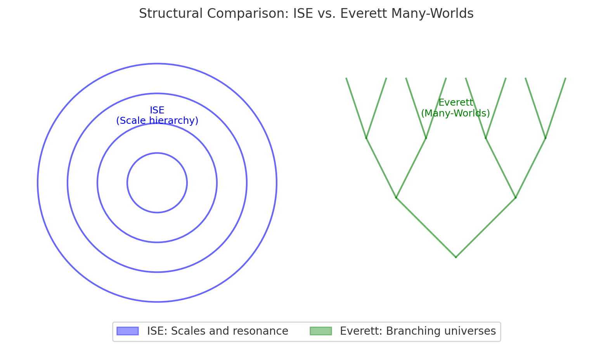
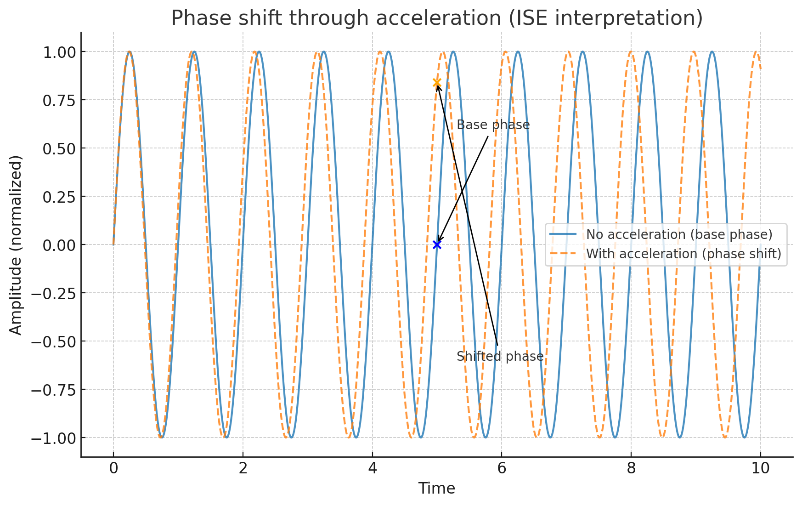
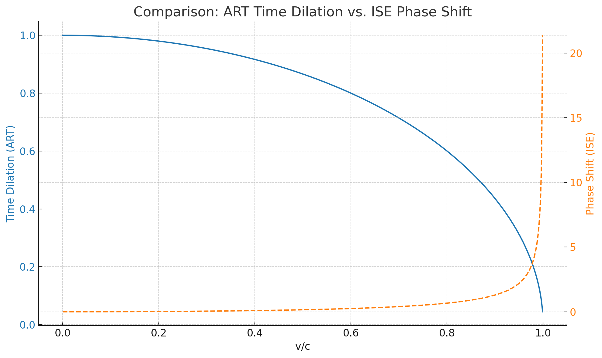
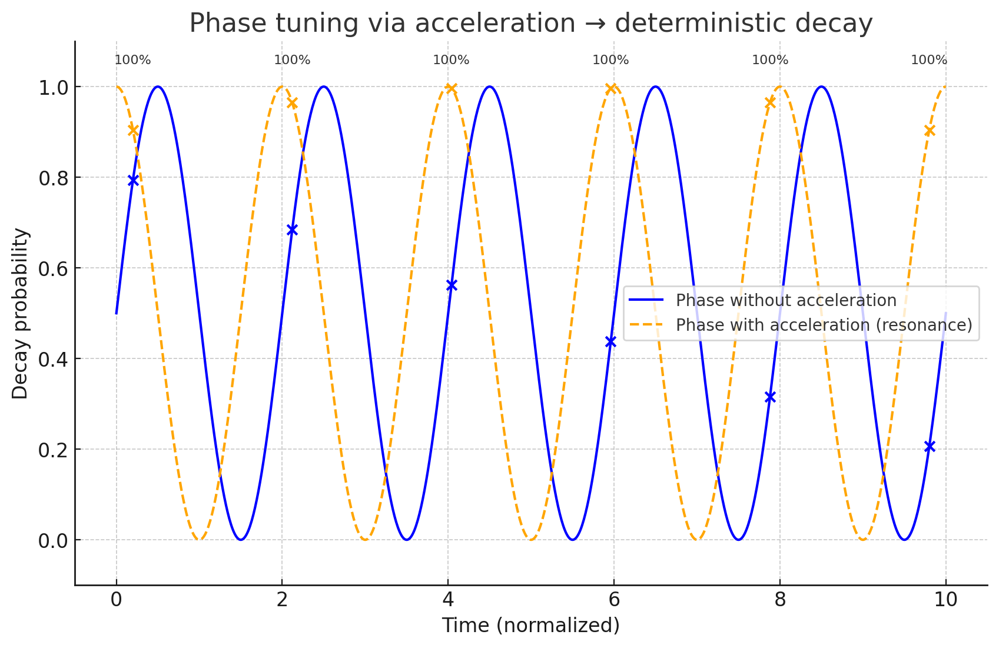

---

## **2.12. Randomness and Acceleration**

The concept of determinacy serves as the foundation for discussing randomness. A deterministic universe is one in which every state follows uniquely from previous states according to fixed physical laws, without genuine chance or alternative developments. In such a framework, what is often called “randomness” is epistemic — it arises from limits in knowledge or the complexity of interactions, not from fundamental indeterminacy.

Complexity itself is derivative rather than original. It emerges from simpler initial states and rules, meaning it cannot produce true randomness if the foundation is deterministic. Real randomness, in contrast, would require a process whose outcome is not fully determined by preceding conditions, as proposed in certain interpretations of quantum mechanics where measurement yields multiple possible results from a single quantum state.

However, quantum mechanics formally frames this in terms of probability distributions rather than randomness. The wave function evolves deterministically, and the probability distribution over possible outcomes is fixed by its form. The unpredictability lies only in the selection of a single outcome, while the distribution’s overall structure is predetermined. This suggests that randomness is itself governed by deterministic principles, producing fixed statistical frequencies over many trials.

From the ISE perspective, this points to an ordering problem: all potential states exist within the wave structure, but the sequence in which they manifest is unknown. At the quantum level, time may not progress in the linear fashion observed macroscopically. The evolution is orderly in the mathematical sense, but the realization of specific states does not adhere to a pre-defined classical sequence, blending determinacy with apparent indeterminacy.

No existing Theory of Everything derives randomness as a fundamental principle. In approaches like string theory, loop quantum gravity, or other TOE frameworks, randomness is either not addressed or is adopted from quantum mechanics without explaining its deeper origin.

The ISE does not introduce randomness as a fundamental quantity. Instead, it explains it as a scale phenomenon:

* **Foundation**: On the lowest scale, complete determinacy prevails.  
* **Emergence of randomness**: Apparent randomness arises from the phase relationship and resolution limits between scales when an observer cannot access all scales.  
* **Significance**: Randomness is thus an ordering problem caused by limited resonance, not an independent physical entity.

**Definition of Randomness**

**Randomness** in the ISE is not a fundamental component of physical reality but a scale phenomenon. On the lowest scale (protoinformational ground state), every state is fully determined. Randomness arises only relative to an observer when the resolution limit of their observational or measurement scale cannot fully capture the phase relationship between scales. This phase relationship is itself deterministic but appears ambiguous from the observer’s viewpoint because they only perceive a projection of the complete state onto their own scale. The term “randomness” therefore describes the subjective experience of an unpredictable sequence or manifestation of events whose full order and cause lie in scales outside resonance with the observer’s scale.

Randomness is derivable from first principles because it follows directly from the scale structure and the deterministic phase relationships between scales. There is no “primary randomness” — only the observer’s perceptual gap produces what appears to be randomness. Its origin is thus both logically and physically traceable to the fundamental principle of scale expansion.

**Randomness in Other Fields and Philosophical Traditions**

Across history and disciplines, attempts to derive the origin of randomness can be grouped into three broad categories:

**Metaphysical Derivations**

* **Indeterminism** (Aristotle, Epicurus): Events arise without cause ("clinamen" / deviation in the motion of atoms).  
* **Causality gaps**: The view that causal chains may be incomplete, allowing points of acausality.

**Epistemic Models**

* **Randomness as ignorance** (Laplace): Everything is determined, but insufficient knowledge of initial conditions produces subjective randomness.  
* **Complexity theory**: Randomness is a practical term for systems whose computation exceeds the observer’s capacity.

**Mathematical and Logical Approaches**

* **Algorithmic information theory** (Kolmogorov, Chaitin): Randomness is maximal lack of pattern; a sequence is random if it cannot be compressed into a shorter description than itself.  
* **Probability as axiomatics** (Kolmogorov axioms): Randomness is not derived but defined as a formal property within a model.

None of these approaches provide a *fundamental* physical origin in the way the ISE claims to. The ISE does not belong to category 2, because in epistemic models randomness is merely a gap in knowledge, whereas in the ISE it is a structural consequence of the scale architecture. Complete order exists objectively on all scales, and the perception gap necessarily results from limited resonance between scales. This places the ISE in a distinct category: **Structural-deterministic derivation**.

**Relation to Multiverse Interpretations**

Many multiverse interpretations, especially the Everettian Many-Worlds Interpretation, also deny fundamental randomness:

* All possible outcomes of a quantum process occur deterministically in separate branches of the universe.  
* Randomness is merely the subjective experience of which branch one inhabits.  
* Mathematically, this corresponds to another axis or dimension along which states are distributed.  
* Probabilities reflect the *measure distribution* over these states rather than intrinsic uncertainty.

This superficially resembles the ISE view, but differs in that Many-Worlds uses branching without a scale without a scale hierarchy, attributing the effect to branching alone rather than resonance or resolution limits.

{width=50%}

 **The Masked Randomness of the Many-Worlds Interpretation**

The Many-Worlds Interpretation (MWI) claims to preserve strict determinism: the universal wavefunction evolves unitarily, with no collapse, and all outcomes occur in separate branches. On this view, there is no physical randomness — only the appearance of chance arising from an observer’s self-location within the branching structure.

However, this shift does not eliminate randomness. It **redefines and conceals it**:

* **Observer indexation as a placeholder for selection**  
   In MWI, the question *“Why do I observe this particular result?”* is replaced by *“You are in the branch where this result occurs.”* This is not an explanation — it is a tautology. The absence of a causal mechanism for branch assignment means that the process remains, in effect, random.

* **No claim to superdeterminism**  
   Superdeterminism would require that *which* branch you find yourself in is fully determined by prior conditions of the universal wavefunction, including the microstate that constitutes your observer-moment. MWI offers no such derivation. The branching is deterministic, but your subjective placement is not causally entailed by the pre-branching state.

* **Persistence of unresolved randomness**  
   By relocating randomness from the physical process (collapse) into the epistemic act of self-identification, MWI leaves the core problem untouched. The underlying issue — why this observer-moment is associated with this specific outcome — is no closer to resolution. The “masking” consists in framing the problem as one of perspective rather than ontology, but the indeterminacy remains just as real from the standpoint of lived experience.

* **Comparison with collapse**  
   In collapse-based models, the randomness is explicit: the wavefunction reduces to a single outcome without a causally sufficient prior condition. In MWI, the randomness is implicit, surfacing only in the indexical uncertainty of the observer. This uncertainty is *functionally equivalent* to ontological randomness, yet is presented as a deterministic inevitability.

From the ISE standpoint, MWI’s determinism is incomplete: it is a determinism of *structure* but not of *placement*. The theory’s elegance lies in eliminating physical selection events, but it does so by displacing the problem into an unacknowledged layer of random assignment — a layer it neither models nor explains. This is not superdeterminism; it is determinism with a hidden, unexamined stochastic core.

 **Independence of Measurement Outcomes and Dual-Source Randomness**

If a probability distribution were itself a single physical system, then measurements taken within it could not be truly independent. True independence can only occur at the intersection of two entirely separate systems. This requires that the systems have no interaction of any kind — physically, they must be acausal relative to each other. Such complete separation implies a scale hierarchy in which each system resides on a distinct scale.

This interpretation produces a strong test criterion:

* **Premise:** If measurement outcomes are *truly* independent, there must exist two completely distinct systems.  
* **Implication:** In a fully interconnected universe without a scale hierarchy, absolute independence is impossible because all processes would be causally linked at some level.  
* **Conclusion:** The statistical independence observed in real experiments can only be fundamentally explained if a scale hierarchy exists, with the two systems anchored on different scales and thus acausal relative to one another.

Independence here is not just a property of probability but structural evidence for a deeper scale architecture, consistent with the ISE framework.

From this follows an attempt at a proof about randomness itself: irrespective of scale hierarchies, the core assertion is that randomness is generated exactly at the subjective intersection between precisely two acausal levels.

This connects to rare but relevant ideas in science and philosophy:

* **Mathematical Basis**  
  * Independence in probability theory is defined via the product measure: P(A ∩ B) = P(A)P(B).  
  * This is equivalent to the underlying random variables having no shared cause or correlation.  
  * Physically, strict independence requires the systems to be acausal.  
  * The “subjective intersection” is when an observer perceives results from both systems together despite no interaction.  
* **Physical Analogues**  
  * Bell’s theorem / local realism focuses on violations of independence via quantum entanglement, not its origin.  
  * Statistical mechanics: noise can arise when a measurement device mixes outputs from two independent microdynamics.  
  * Algorithmic information theory: maximal randomness can result from mixing two fully independent information sources.  
* **Philosophical Parallels**  
  * Dual-source randomness claims true randomness is only experienced where two independent reality-streams meet.  
  * The ISE frames this physically: two acausal levels → intersection = experienced randomness.  
* **Mechanism and Analogy**  
  * Two independent sequences, a1, a2, … and b1, b2, …, combine via f(ai, bj) with uncoordinated indices.  
  * For an observer, outcomes appear random even if both sequences are deterministic.  
  * Example: two unsynchronized clocks in independent time dimensions; defining an event by both showing even numbers makes it appear random because there is no shared order.

In essence, the ISE treats randomness as relation-based rather than intrinsic — arising from the structural meeting point of two acausal systems.

Causality inherently implies that processes operate within a single scale level. The only factor that can shift one scale level relative to another is time. In this sense, when a random number generator (RNG) outputs a sequence of numbers, it is already performing a scale cut that is displaced through the parameter of time.

In this context, **causality** means that two processes operate within the same scale, enabling events in one process to influence the other through direct cause–effect relationships. **Acausality** between processes can only occur when they are anchored on different scales, with no causal bridge between them.

Applied to RNGs, an output sequence of “random” numbers is itself the **intersection** of at least two distinct levels:

* The level where the underlying physical process occurs (e.g., quantum fluctuation, thermal noise).  
* The level where the resulting values are recorded as a linear time series.

  Time acts as a **relative shifter** between these levels, such that each measurement captures a particular phase relationship between them. As a result, the full sequence is not merely a continuous “flow of randomness” but rather a projection shaped by this relative temporal displacement.

  From this perspective, even a single RNG is not a pure source process but an **internal dual-source structure** (process level \+ time sampling). It remains internally causally closed as long as both components occupy the same scale. Genuine dual-source randomness emerges only when the two contributing levels are fully acausal with respect to each other.

There have indeed been both physical and philosophical attempts to explore the nature of randomness, but none has produced a definitive derivation of its fundamental origin. Broadly, these attempts fall into three categories:

* **Quantum Experiments – Randomness as Fundamental or Apparent**  
  * **Quantum Random Number Generators (QRNGs):** Use quantum two-state systems (e.g., photon polarization, tunneling events) as sources of supposedly fundamental randomness. These focus on statistical quality (bias, correlation) rather than the underlying cause.  
  * **Bell Tests / Loophole-Free Bell Experiments:** Designed to rule out local hidden variables; if quantum mechanics is correct, measurement outcomes are not locally deterministic.  
  * **Wheeler’s Delayed-Choice Experiments:** Test whether measurement decisions can retroactively affect quantum states, probing both temporal and causal aspects of randomness.  
* **Complexity and Chaos Research – Randomness as Emergent**  
  * **Chaotic Systems:** Experiments with double pendulums, turbulent flow, and chaotic oscillators show that deterministic systems can become effectively unpredictable, making randomness epistemic rather than fundamental.  
  * **Algorithmic Randomness Tests:** Examine physical data streams (e.g., cosmic rays, thermal noise) for incompressibility, linking randomness to maximal algorithmic complexity.  
* **Philosophically Inspired Experiments – Randomness as a Relational Phenomenon**  
  * **Cosmic Bell Test (2017):** Uses photons from distant quasars to set measurement parameters in a Bell test, aiming to break possible causal connections between setting choice and particle measurement.  
  * **Dual-Source Methods in Information Theory:** Combine two independent physical processes (e.g., XOR of two RNGs) to produce maximal randomness, often for cryptographic purposes rather than ontological investigation.

**Conclusion**

Some experiments (Bell tests, Cosmic Bell Test, Wheeler’s Delayed Choice) address the *manifestation* of randomness and challenge deterministic explanations, but none has fundamentally derived or proven randomness itself. It remains unresolved whether unpredictability is truly fundamental or an artifact of limited access.

From the ISE standpoint, each measured event is the intersection of two acausal levels. Before measurement, these levels evolve independently with no defined phase relationship. The act of measurement forces a coupling, creating a specific outcome and eliminating the original acausality. What we call a “particle” is only an abstract model; the true physical occurrence is the measurement event itself — the momentary causal coupling. This coupling is unique and non-replicable because once established, the two levels share a causal state. The particle concept is therefore a residual image of this coupling within our causal framework.

It is a common misconception to assume that two independent measurements can share an underlying, universal time or medium by which their results can be directly aligned. In reality, each measurement has its own distinct "proper time" and its own gradual scale determined by its spatial and causal context. Even if two detectors are positioned extremely close together, they still reside in separate spatial domains with independent temporal frameworks. Between two index positions in one system, there could be a second, billions of years, or an unbounded number of distinct events elsewhere in the universe. There is no implicit global clock or shared base medium to guarantee synchrony between acausal systems. Therefore, in the ISE framework, any attempt to match results between two truly acausal measurements must account for the fact that their scales are independent and not directly measurable against one another.

**Postulate Under Test**  
We examine a single measurement stream — for example, the sequence of 0s and 1s from a random number generator — to determine whether **hidden scales** are present within it.

* **Idea:** If the ISE is correct, the results are not entirely scale-free. Instead, there will be distances or patterns that recur at specific magnitudes, regardless of how time is measured.

* **How to detect this:**

  * **Aggregate bits into blocks** (e.g., sequences of 4 or 8 bits) and reduce each block to a single bit. If the underlying scale changes, the statistical properties of the sequence may shift slightly with the block size.  
  * **Count run lengths** (how many consecutive 1s before a 0 occurs). If these frequencies show oscillations that repeat on a logarithmic scale, it suggests a hidden scale structure.  
  * **Examine ordinal patterns** — the order of values — without referencing physical time. Certain patterns should occur more frequently if a hidden scale governs the sequence.

* **Key point:** This approach uses only a single measurement stream, without a second measurement, without a global clock, and without assuming a common medium. It focuses solely on the sequence’s **internal order** to determine whether recurring scales emerge — potentially revealing the imprint of the ISE scale hierarchy.

It is natural to ask whether researchers have already attempted to find patterns in physical randomness. In fact, they have — but so far, all such efforts have concluded that, within measurement accuracy, no reproducible pattern exists. This work spans several areas:

* **Quantum Random Sources (QRNGs)**  
  * Commercial and research QRNGs (e.g., from ID Quantique, QuintessenceLabs, NIST) have undergone extensive statistical and correlation testing (NIST suite, Dieharder, TestU01).  
  * These tests aimed to detect bias or dependence; none found systematic deviations beyond technical artifacts.  
  * Limitation: they focus on linear or periodic correlations, not scale-related or log-periodic structures.  
* **Cosmic Sources**  
  * The 2017 Cosmic Bell Test used starlight or quasar photons to set measurement parameters in Bell tests, excluding local causal links.  
  * Side analyses for bias found no significant patterns.  
  * Limitation: emphasis was on independence of settings, not on detecting scale structures in the event stream.  
* **Radioactive Decay Sequences**  
  * Nuclear physics labs have studied decay events for long-term correlations or periodicities, partly to test solar influence hypotheses.  
  * Most results found no effect; occasional weak periodic reports (e.g., annual) are disputed and often attributed to environmental factors.  
* **Chaotic but Deterministic Systems**  
  * Experiments with chaotic oscillators and laser chaos search for noise impurities for quality control.  
  * Found structures are treated as technical artifacts, not fundamental signatures.

**Why this postulate remains novel**

Most prior tests treat randomness as a flat sequence and look for deviations at fixed, linear intervals. A search for log-periodic or scale-invariant patterns — recurrences at geometrically scaled distances — appears absent in published physics literature. This methodological difference makes the proposed ISE test distinct.

While it is convenient to describe the ISE framework in terms of a “scale hierarchy,” this is a simplification. In reality, the scales are infinitely gradual in relation to the universe’s differentiation. Any underlying structure would not appear as a single sharp resonance, but as a finely tiered, fractal-like modulation of extremely small amplitude, extending across many orders of magnitude. Such a modulation would form not one isolated measure, but an entire continuum of interwoven measures.

**Implications for data requirements:**

* Detecting such a structure statistically would require extraordinarily long, high-quality data streams, because each individual scale level contributes only a minute effect.  
* The signal-to-noise ratio for any single level is likely far below 1; only by integrating across many levels could a coherent pattern emerge.  
* Realistically, this could entail analyzing datasets containing billions to trillions of events to consistently detect a signature spanning multiple gradations.

  **Analytical approach:**  
* Rather than seeking a single periodic frequency, one would use wavelet or multifractal analysis on the event stream.  
* The goal is to construct a spectral density over logarithmic scales that is not flat, but reveals a structured, cross-scale profile.  
* If present, such a profile would serve as a fingerprint of this continuous differentiation.

  If this perspective is correct, then the “perfect” statistical distribution — such as a normal distribution for continuous data or a 50:50 balance for binary data — would not represent the absence of a signature, but the signature itself: the final projection of infinitely many minute scale effects combined into a smooth statistical form. In this interpretation, “randomness” is simply the name we give to this total projection. The task would then be to decompose the apparent randomness to uncover the contributing layers, potentially using frequency analysis over logarithmic scales to reveal recurrent enhancements associated with dominant regions of the continuous scale structure.

If all scale levels were equally represented, the resulting scale profile would show no distinct peaks — only a completely flat line. In this case, the perfect statistical uniformity would itself be the signature. This implies:

* In the pure form of this assumption, the universe has no preferred scales; each level contributes equally.  
* The observed uniformity in statistical randomness would not indicate that “nothing is happening,” but that all scales are fully superimposed without any dominance.  
* If correct, a scale hierarchy could not be demonstrated through isolated peaks, but only by showing that the measured uniformity cannot be explained by finite complexity or technical sources.

The proof would thus proceed along the following lines:

If we can demonstrate that a perfect, scale-invariant uniform distribution exists — and that it cannot result from any finite, purely causal process — then it follows that it must arise from an infinite, gradual superposition of scales.

**Multi-Component Physical Processes and Absolute Simultaneity**

While certain physical processes involve more than two independent components, “absolute simultaneity” is problematic because in relativity simultaneity is observer-dependent. If defined more narrowly as multiple physically independent degrees of freedom participating in the *same event space*, examples include:

* **Many-Particle Quantum Processes** — In quantum field theory, multiple field types can interact nontrivially at a single spacetime vertex (e.g., gluons, quarks, photons all participating in one scattering event).  
* **Multimode Entanglement** — Photons can be prepared in states entangled across three or more modes simultaneously (e.g., polarization, time-bin, and orbital angular momentum).  
* **Coincidence Reactions in Nuclear Physics** — Certain decays emit multiple particles effectively simultaneously (within experimental resolution), such as triple-coincidence measurements.  
* **Macroscopic Nonlinear Couplings** — In nonlinear optics, higher-order parametric processes can split a pump photon into three or more photons at once.

If “absolute simultaneity” is taken to mean three or more *acausal levels* intersecting in one measurement, such cases are rarer still and, in ISE terms, would be interpreted as a single causalization event linking multiple previously independent streams.

In practice, any simultaneity is bounded by measurement resolution. Processes may only appear simultaneous because they occur faster than the resolution limit (e.g., below the Planck time or instrument resolution). At sub-Planck scales, an unobservable internal sequence could determine whether a multi-component interaction occurs at all — if the required internal ordering arises, the effect manifests; if not, it does not. This hidden ordering would translate, at our scale, into a measurable probability, much like the probabilistic outcome seen when coupling two acausal levels. In this view, apparent randomness may mask a definite but inaccessible internal sequence, making measured probabilities aggregates over all such hidden sequences.

An experimental thought experiment could address this by artificially stretching the condition so that an otherwise invisible internal sequence becomes distinguishable. One of the stretched sequences would then produce an effect, while the other would not.

**Core idea:** Artificially stretch the sequence to make a hidden order experimentally distinguishable.

**Concrete, feasible approaches:**

* **Three-pulse protocol (ultrashort time, Pump–Control–Probe)**  
  * **System:** e.g., three-level atoms/molecules (Λ or V scheme), superconducting qutrit, quantum dot.  
  * **Action:** Generate three excitations A, B, C and vary **permutation** and **delays** $(\Delta t_{AB}, \Delta t_{BC})$.  
  * **Expectation (internal order):** Target transition/signal appears **only** for one specific order and delay band; disappears if order is swapped.  
  * **Lab parallels:** STIRAP / “counter-intuitive” order, coherent control, Pump–Dump–Probe.  
* **Nonlinear optics, triple coupling**  
  * **System:** sum-frequency / third-order mixing (χ^(2) / χ^(3) crystal) with three fields A, B, C.  
  * **Action:** Temporal stretching of one pulse (chirping/dispersion path) \+ delay scan of all permutations.  
  * **Expectation:** Target frequency efficiency only if the **internal** arrival/overlap order is “correct”; otherwise null lines despite identical energies.  
* **Three-photon interference / multi-coincidence**  
  * **System:** three inputs of an interferometer (generalized Hong–Ou–Mandel).  
  * **Action:** Fine-tune **arrival order** (picosecond–femtosecond delays).  
  * **Expectation:** Deep coincidence dips/bumps **only** for one permutation; other permutations destroy interference.

**Minimal protocol (for all three variants):**

* Keep spectra/intensities identical; vary **only** order and delays.  
* Measure target observable S (transition probability, mixing efficiency, coincidence rate).  
* Plot S vs. $(\Delta t_{AB}, \Delta t_{BC})$ for each permutation.  
* **Signature of the internal sequence:** a **compact plateau** S\>0 exists exclusively for **one** permutation; the other two show S≈0 across the entire delay space.  
* Controls: subtract single-pulse contributions; measure two-pulse partial terms separately; phase randomization to test robustness.

**Interpretation:** If a process previously showing \~50% probability becomes deterministically selective through stretching, the observed probability is an artifact of unresolved order. This supports the thesis “Probability = projected internal order.”

**Logical Perspective Transition**  
Up to this point, the discussion has examined randomness primarily from historical, physical, and classificatory viewpoints, focusing on how the ISE frames apparent indeterminacy as a structural effect of scale relationships. We have traced how determinacy at the protoinformational level, coupled with limited resonance between observational scales, produces the perception of randomness without invoking it as a fundamental property. Comparative treatments from metaphysics, epistemology, mathematics, and multiverse theories have been evaluated against the ISE’s structural–deterministic derivation, highlighting its distinct emphasis on resonance limits and acausal intersections. Experimental and analytical strategies have been proposed to detect scale hierarchies within random sequences, including hidden-order detection, multi-component simultaneity, and temporal stretching protocols, without resolving the ultimate question of randomness’ fundamental origin.

This framework reframes randomness as the emergent projection of interactions between acausal levels, observable only when distinct systems intersect without a shared causal structure. Physical examples, theoretical analogues, and methodological approaches have been explored to map this perspective onto measurable phenomena. The resulting picture is one in which statistical uniformity may conceal an infinite continuum of small-scale contributions, and probability distributions can reflect inaccessible internal orders. This sets the stage for a shift from the physical–historical framing to an anthropomorphic–logical examination, where randomness will be reconsidered through the lens of logical structure and human conceptualization, positioned alongside the earlier scale-based account.

### Is it Unlikely that True Randomness Exists?

* **Epistemological Aspect**  
  Throughout history, every process once thought to be fundamentally random — whether dice rolls, planetary motion irregularities, or Brownian motion — has, with improved understanding, been reframed as determined by underlying causes. Quantum mechanics, despite its probabilistic formalism, can be seen as another step in this sequence rather than an endpoint. There is no compelling reason to believe that at the quantum level the chain of causal explanation must cease, and strong reason to expect that the appearance of randomness is due to hidden structural determinants still beyond our measurement reach.  
* **Physical Aspect (Collapse = Acausality)**  
  From a strictly physical point of view, the existence of true randomness is disputed.

**Arguments against true randomness:**

* Many interpretations of quantum mechanics (e.g., Bohmian mechanics, Many-Worlds) are strictly deterministic — the apparent randomness is a projection effect from limited information.  
* Classical mechanics and relativity are fully deterministic.  
* Chaotic but deterministic processes can yield "random" behaviour in practice (epistemic randomness).

**Arguments for true randomness:**

* The standard Copenhagen interpretation posits wavefunction collapse as fundamentally non-deterministic.  
* Bell tests, assuming certain conditions, have ruled out local hidden variables, supporting fundamental unpredictability.  
* Quantum random number generators show no evidence of hidden deterministic patterns so far.

**Problem:**

* No experiment can definitively prove something is truly random, since finite data always allow construction of complex deterministic explanations.  
* Conversely, true randomness cannot be logically excluded because it is consistent in formal models.

At its core, this remains an interpretational issue until a mechanism is found that clearly distinguishes deterministically hidden processes from genuinely fundamental randomness. In a deterministic–structural model like the ISE, even apparent collapse randomness must arise from deeper, scale-dependent order to maintain universal interconnectedness.

**The Implicit Criterion of Randomness Derivation in Any TOE**

It appears that this fundamental requirement is not even recognized by most current Theory of Everything (TOE) candidates. The point is essential: an implicit but unavoidable criterion for any TOE is that it must be able to *derive* the appearance of randomness from deeper first principles.

This is rarely stated outright in the literature, yet logically it follows:

By definition, a TOE claims to account for *all* physical phenomena from a unified set of foundational laws. If true, irreducible randomness exists (i.e., an event with neither cause nor governing rule), there would be events that cannot, in principle, be deduced from these laws. A theory allowing such irreducible randomness cannot be a *complete* TOE; it would instead be a partial framework that models only the causal subset of reality. Therefore, an implicit requirement for any genuine TOE is the capacity to explain *apparently random* phenomena as emergent from an underlying deterministic or at least fully specified structure.

Notably, many existing TOE approaches (e.g., String Theory, Loop Quantum Gravity, Causal Set Theory) rarely confront this head‑on. Instead, they tend to inherit the quantum mechanical notion of randomness without challenging its ontological status. Applied rigorously, this criterion would compel any TOE author to include an explicit statement such as:

*This theory accounts for phenomena presently treated as fundamentally random in standard quantum mechanics by deriving them from a deeper deterministic framework.*

Absent such a statement, a candidate theory is — strictly speaking — not a true TOE but an extended partial model.

**A Critical Appraisal of Valentini’s Non-Equilibrium Bohmian Program**

Valentini’s proposal retains Bohmian mechanics’ deterministic dynamics while discarding the quantum-equilibrium postulate. By permitting initial distributions that differ from the Born distribution, he reframes the Born rule as a contingent, late-time statistical state reached through a relaxation process. This opens the door to empirical deviations from standard quantum predictions, potentially allowing subquantum signaling and preserving cosmological relics of non-equilibrium.

The formalism rests on continuity equations for the actual and Born distributions, which together imply equivariance: the ratio of the two remains constant along Bohmian trajectories. This leads to conservation of the fine-grained H-function, with relaxation emerging only after coarse-graining — mixing in configuration space drives the coarse-grained H-function downward. However, this relies on strong mixing assumptions and the typicality of initial conditions, effectively reintroducing probabilistic neutrality without deriving it from first principles.

Coarse-graining, while operationally justifiable due to finite measurement resolution, is not unique and risks circularity if informed by the very statistical structure it aims to explain. Moreover, smooth, non-fine-tuned initial conditions are required, functioning as a hidden Past Hypothesis that shifts rather than resolves the explanatory burden.

Cosmological arguments, such as inflationary relaxation to equilibrium, are model-dependent and face alternative astrophysical explanations. Experimental searches for non-equilibrium effects have not yet produced robust results. Relativistic extensions are further complicated by the fact that non-equilibrium generically enables superluminal signaling, forcing near-equilibrium constraints that dilute novelty or requiring a preferred foliation that demands independent justification.

Even if universal relaxation were accepted, assigning numerical probabilities requires an additional measure over initial conditions, which often invokes assumptions equivalent to those in other Born-rule derivations. Without a mechanism-first account of probability weights, the approach risks circular reasoning.

From the perspective of the ISE, Valentini’s framework still assumes a neutrality of initial conditions, whereas ISE treats probabilistic symmetry as emergent from structural superposition across scales. Valentini’s work remains mathematically coherent and empirically ambitious, but as a derivation of quantum probabilities it relocates rather than eliminates the central mystery of the Born rule.

**Randomness in Decay Processes**

We have another point addressed in the ISE: decay processes. There is a conflict in the definition of random decay processes. Half-life and randomness exclude each other, since half-life already constitutes a causal rule — a mechanism.

In standard physics, radioactive decay is described as fundamentally random: each atom has at any moment the same probability to decay, independent of its history. Yet the half-life relation with constant is exact and deterministic for the ensemble. The contradiction is evident: a precise global law implies a mechanism acting over the entire ensemble, and this mechanism must be causal.

In the ISE, the apparent randomness of decay is not primitive, but arises from the intersection pattern of two scale levels: the microstructure of the particle or nucleus, internally ordered and causal, and the overlaid scale structure of the universe, also causal but acausal relative to the first. Decay occurs only when both levels achieve a particular internal phase relation. The half-life is then simply the macroscopic statistic of these intersections — not proof of true randomness.

From our perspective, individual events are unpredictable because we cannot measure the internal phase relation between the two levels, while the overall statistics remain stable because the intersection probability is constant over time. This resolves the logical conflict: half-life ≠ randomness axiom, but rather the macroscopic projection of a causal yet hidden mechanism.

This does not, by itself, disprove the existence of randomness; rather, it shows that the standard formulation of decay processes as purely random is imprecise, since it simultaneously invokes a deterministic law.

**Linking Randomness and Acceleration**

An instructive case emerges from the time dilation observed in muon decay, where the measured half-life in the laboratory frame is extended when the particle is moving at relativistic speeds. The proper half-life of a muon at rest is about 2.2 microseconds, yet in particle accelerators this lifetime is observed to increase significantly with velocity. Special relativity explains this as a consequence of time dilation: the muon's own clock runs more slowly relative to the lab frame.

From the standpoint of the ISE, this observation has direct implications for the nature of decay probabilities. If decay were governed by a truly fundamental, context-free randomness, then the probability per unit of proper time should remain unaffected by acceleration — identical in all inertial states. Instead, the data show that decay probability is always tied to the particle's own proper time, revealing a dependence on an internal causal clock.

The decay event probability reflects the intersection frequency between two scale levels: the microstructure of the particle and the overlaid cosmic-scale structure. Relative motion changes the temporal phase spacing between these levels, reducing the intersection frequency in laboratory time and thus extending the apparent half-life. This interpretation frames time dilation, altered decay probabilities, and collapse delays as manifestations of the same underlying effect: a shift in relative scale phase.

This unified view eliminates the need for separate 'spacetime' and 'probability' clocks. Both time perception and statistical event distributions arise from one phase structure. It further suggests that under certain acceleration profiles, measurable deviations from standard-model decay distributions could occur even at identical Lorentz factors, offering a potential empirical test of the scale-phase hypothesis.

{width=50%}

**Phase-Matched Determinism via Relative Acceleration**

This would imply that absolute determinism in measurements could be achieved by subjecting the measured system to a precisely specified **relative acceleration**. In General Relativity one would deliberately use **time dilation** tuned to yield an exact outcome. The required acceleration profile could, in principle, be inferred from repeated **identical outputs of the same physical RNG**. Unfortunately, such a profile would be **non-reusable**.

This is essentially a **phase-matching experiment** based on relative acceleration.

If we adopt the ISE logic:

* Every measurement is an **intersection** of two scale levels.  
* The probability of that intersection depends on the **relative phase** between those levels.  
* **Acceleration** changes that phase **systematically**.

{width=50%}

{width=50%}

**What this implies**

* **Absolute determinism for a single event.** If the exact **phase profile** is known, one can steer the intersection so that the event occurs with **100% probability** (or is inhibited with 0%). For a physical RNG this amounts to turning it into a **determinism generator** under a one-off, tuned profile.  
* **The profile is not reusable.** Each measurement irreversibly **shifts the phase** (due to measurement coupling). The original starting phase between the levels no longer obtains afterward; hence the same profile cannot be applied again.  
* **GR as the operational tool.** Time dilation is the visible symptom. Within **GR**, one may view the procedure as **targeted manipulation of proper time** so as to hit the required **phase resonance**.

**Acceleration is the only proto-informational change of magnitude** that does **not** constitute a collapse yet **does** modify differentiation resolution. Under acceleration, the **modulus of the potential vectors** changes. This produces an effective **shift of differentiation alignment** and thus of **phase**.

**Acceleration as a special case**

* In ISE, every **measurement** is a **collapse**: an irreversible coupling of two levels.  
* **Acceleration**, by contrast, is **not** a measurement: it changes the **magnitude** of potential vectors **within** a level.  
* Nothing collapses, but the **relation to other levels** changes — i.e., **differentiation shifts**.

**Phase shift without information loss**

* Because no collapse occurs, the **full internal order** is retained.  
* Acceleration acts like turning the **scale-phase dial**: it shifts where intersection points lie in “scale space.”  
* The result is a **relocation of phase**, which later determines **when** and **whether** a coupling (measurement) occurs.

**Consequences for randomness and determinism**

* By steering the phase so that measurement lands in a **specific resonance**, the outcome becomes **deterministic**.  
* Because acceleration is **continuously tunable**, exact prediction is theoretically possible — **if** the internal phase structure is known.

**Why this is powerful**

* In standard physics: acceleration changes only **velocity and energy**.  
* In ISE: acceleration changes the **position in the differentiation space**, i.e., the **deep condition** underlying all event probabilities.

One must not forget that in **GR** acceleration also produces a **shift in time**, which can be interpreted as **desynchronization** — a departure from simultaneity, causality, or time-phase.

In GR, acceleration is always a change of **proper time** relative to other systems. In the ISE interpretation this is directly a **desynchronization of scale phase**:

* **GR view:** Acceleration ↔ gravity / accelerated motion → **proper time** differs from coordinate time.  
* **ISE view:** The time difference is not merely geometric; it is a **shift of scale phase** in the differentiation space.

Thus:

* **Simultaneity becomes relative** — event order can appear differently across frames.  
* **Causality is locally modulated** — not violated, but **re-calibrated** via phase to set the conditions under which an event is possible.  
* **Time-phase couples to measurement-phase** — what GR describes as time dilation corresponds, in ISE, to an **active inter-level shift** that later shapes “randomness.”

Viewed this way, every form of acceleration is a tool to **step aside from global causal alignment** without violating causality, simply by drifting into a different **internal phase**.

How do I raise a decay probability to **100%**? Simple: I accelerate the **external observation** to near **light speed**.

In ISE terms, that is indeed the operative “trick”:

* **Goal:** Drive the decay probability to **100%**.  
* **Mechanism:** Accelerate the **observer / measurement system** so that its **proper time** is extremely stretched relative to the observed system.  
* **ISE interpretation:** Acceleration shifts the **phase** between observer and object so that the decay point **always** falls at a **resonance maximum**. For the observer, every measurement appears as **“decay now”** — deterministic rather than probabilistic.

Standard physics would say: *you merely see more decays within your shortened proper time*. ISE says: \*the acceleration tuned the scale coupling so measurement always hits a \****collapse point***.

**Caveat.** As soon as a measurement occurs, the **phase shifts irreversibly**. Hence this determinizing profile works for **one and only one measurement** per exactly tuned acceleration profile.

**Polarization Stability, Eigen-Time Randomness, and CMB Tests**

The broader aim of the following is to explore whether the apparent stability of photon polarization can serve as a sensitive probe for deeper questions about randomness and eigen-time in relativistic systems. Within the ISE framework, randomness is not treated as a fundamental property but as an emergent effect of limited resonance between different scale levels. If such inter-scale phase drift exists, it should leave measurable traces in systems where light has accumulated extreme amounts of proper-time–like parameters — most notably, cosmological photons from the cosmic microwave background (CMB). By contrasting the Standard Model’s postulate of perfect vacuum stability with the hypothesis that eigen-time can induce stochastic polarization rotations, this chapter proposes a falsifiability program spanning both cosmological observations and precision laboratory experiments. The goal is not only to test a specific optical effect, but to assess whether light-speed carriers can reveal scale-coupled phase dynamics — thus providing an empirical lever on the underlying treatment of randomness in the thesis as a whole.

If the current Standard Model asserts, by definition, that polarization in vacuum is stable, then no "proof" of stability can be given in the classical sense — only falsification is possible. Any experimental test must therefore be designed to attempt to refute, rather than confirm, the stability assumption.

In such a framework, one can define:

* **Null hypothesis (Standard Model)**: Polarization does not change without interaction; measured EB-correlation values or polarization angles remain invariant with respect to both time and distance.  
* **Alternative hypothesis (Eigen-time driven randomness)**: If eigen-time induces stochastic permutations of the polarization state, then photons should undergo a cumulative random rotation proportional to their proper time. The result would be an EB-correlation that increases with light-travel distance.

A falsification attempt could use either cosmic microwave background (CMB) data or controlled laboratory laser experiments:

*In the CMB case*, the oldest photons, having propagated for \~13.8 billion years, represent the maximum available eigen-time for massless particles in our frame. If eigen-time genuinely drives internal phase permutation, they should exhibit the largest accumulated depolarization or isotropic EB signal. In the Standard Model, any observed EB coupling or stochastic rotation distribution must be explained entirely by known effects such as Faraday rotation, gravitational lensing, or instrumental systematics. In the ISE perspective, even an extremely small per-year permutation rate would integrate over cosmic time to produce a measurable, direction-independent reduction in polarization fidelity or an isotropic EB component — provided the rate is above the experimental noise floor of current or planned missions (e.g., Planck, ACT, LiteBIRD).

*In the laser case*, high-coherence beams could be propagated over long distances or times in ultra-stable vacuum cavities to search for statistically significant deviations in polarization, isolating the eigen-time contribution.

**Interpretational Consequences:** If no deviation is found, the result is consistent with the Standard Model and places upper bounds on any possible eigen-time effect. If a deviation is detected, two interpretations emerge:

* **Finite-scale interpretation (non-ISE)**: The measured rotation rate defines an effective finite scale — reducing "infinity" to a large but bounded number, implying an upper limit to the scale hierarchy and possibly an origin point.  
* **Scale-horizon interpretation (ISE-compatible)**: The measured value represents the resolution limit of our scale — the maximum causal coupling range to higher-order scales. Infinity remains unbounded; only our accessible portion is finite, analogous to a cosmological horizon.

In the ISE view, such a detection would reveal not the size of infinity but the *minimum resolvable eigen-time unit* of our scale, a constant emergent from our specific position in the scale hierarchy. This constant would be tied to the speed of light, much like the Planck time is tied to quantum-gravitational limits, but here it would encode the finest phase resolution in eigen-time before inter-level coupling effects vanish into the background.

**A Falsifiability Program for Proper-Time–Driven Randomness**

**Premise.** If the Standard Model (SM) already stipulates that **vacuum polarization is stable** (no rotation/depoloarization without interaction), no classical “proof” can establish an effect; only **falsification** is meaningful. Accordingly, any empirical strategy must be cast as a null-test against the SM.

**Hypotheses to test.**

* **H₀ (Standard Model / Conventional Cosmology):** In vacuum, polarization is conserved along null geodesics; EB cross-correlation and absolute polarization angles are independent of distance and look-back time (after removing known effects: Faraday rotation, lensing, instrumental angles).

* **H₁ (Proper-time/phase-drift hypothesis):** If a system’s **proper-time flow** drives internal **phase permutation**, then carriers that accumulate an effective phase path should exhibit a **stochastic polarization rotation** whose variance grows with path length. In an ISE-compatible variant, the driver is an **inter-scale phase path** (e.g., affine-parameter–weighted or scale-factor–coupled), not necessarily the strict special-relativistic proper time.

**Experimental paradigms**

* **Cosmological polarimetry (CMB \+ large-scale structure).**  
  * Build **EB** and **TB** spectra; estimate an angle field $α(n^)\alpha(\hat n)$. A stochastic rotation (random walk) implies nonzero EB and a scale-independent (or weakly scale-dependent) excess of B-modes.

  * Check **distance/age scaling** by splitting maps tomographically (cross-correlate with lensing potential $\phi$, use low-z synchrotron/thermal-dust as controls). Under H₁, the variance $\langle \alpha^2 \rangle$ should **increase with photonic path length**.

  * Test **frequency scaling** (30–150 GHz and beyond). Magneto-ionic (Faraday) effects scale $\propto \nu^{-2};$ an **intrinsic stochastic phase drift** need not. Lack of $\nu^{-2}$ after calibration disfavors conventional contaminants.

* **Precision laser experiments (laboratory and space).**  
  * High-finesse cavities / fiber loops to extend the **optical path** by $10^9\text{–}10^{12}$ wavelengths with active polarization metrology; search for **variance growth** of the polarization angle vs. round-trip count.

  * Satellite links / drag-free platforms to vary **gravitational potential** and **acceleration profiles**; in ISE the rotation variance could depend on **phase alignment** rather than just path length.

**Expected observational signatures**

* **Under H₀:** EB consistent with zero after lensing removal; polarization angle distributions stationary in time and distance; no residual broadband rotation after frequency-law subtraction; laboratory paths show **no variance growth** beyond instrument noise.

* **Under H₁ (phase drift):** An **isotropic**, path-length–dependent increase in **$\langle \alpha^2 \rangle$**; possibly weak anisotropy if inter-scale coupling is directional; laboratory variance growing with round trips even after environmental systematics are removed.

**Accumulation models and sensitivity targets**

Let $\alpha$ be the net polarization rotation.

* **SM limit (strict vacuum conservation):** $\alpha \equiv 0$ after subtracting known effects.

* **Fixed-rate random walk:** $\langle \alpha^2 \rangle = D,L$, with diffusion constant D (rad² per unit path length L). Detectability requires $\sqrt{D L} \gtrsim \sigma_{\text{exp}}$ (experiment’s angle noise floor).

* **Scale-coupled drift (ISE-motivated):** $\mathrm{d}\langle \alpha^2 \rangle/\mathrm{d}\chi = \kappa(a,\Phi,\dots)$, with affine parameter $\chi$ and coupling $\kappa$ to the **scale factor** a or other inter-scale fields $\Phi$. Growth can be super- or sub-linear in distance; tomographic splits (different effective redshifts) are decisive.

**Sensitivity criterion.** A null result sets $\sqrt{\langle \alpha^2 \rangle} < \sigma_{\text{exp}}$ → **lower bounds** on $\sqrt{D}$ (fixed-rate) or on the integral of $\kappa$ (scale-coupled). Positive detection requires consistent scaling across **sky patches, bands, and instruments**.

**Systematics and discriminants**

* **Faraday rotation** ($\propto \nu^{-2}$), **instrument angles**, **beam mismatch**, **E→B leakage**, **gravitational lensing**. A genuine stochastic phase drift is **broadband** (after calibration), **isotropic (to first order)**, and **path-length dependent** without tracing electron-density maps.

* **Laboratory confounds:** thermal/thermo-optic birefringence, stress-induced fiber birefringence, mirror coating anisotropy. Use **counter-propagating paths**, **temperature control**, **vacuum**, and **rotation-reversal protocols** to isolate any intrinsic drift.

**Why the oldest photons are decisive**

Special relativity assigns **zero proper time** to photons; a strict proper-time-driven model therefore predicts **no effect**. An ISE-compatible variant can instead couple to an **effective phase path** (e.g., the null-geodesic’s affine parameter or the evolving scale factor), allowing cosmological photons to accumulate the **largest observable effect**. Thus CMB photons give the **maximal lever arm**.

* **Null result:** Consistent with SM and the strict ISE claim that **no proper-time flow ⇒ no permutation** for free photons; yields **lower bounds** on inter-scale coupling.

* **Positive result:** A calibrated, broadband EB excess or isotropic rotation increasing with path length would be a **sensational deviation**, pointing to additional dynamics akin to ISE’s **inter-scale phase drift**.

**Interpreting a nonzero signal within ISE: horizon vs. infinity**

A measured variance does **not** quantify “the size of infinity.” It reveals the **extent of coupling** between our scale and a higher-order level — a **scale horizon**. Like the cosmological horizon, it marks a **limit of causal reach**, not a boundary of existence. Infinity remains unbounded; the measurement constrains only the **interaction bandwidth** available to our scale.

Formally, a null bound $\sqrt{\langle \alpha^2 \rangle} < \sigma_{\text{exp}}$ over path length LL implies a **lower limit** $⁡S > S_{\min}$ on the **scale-coupling horizon** S, via a model-dependent map $\{D,\kappa\} \mapsto S$. Conversely, a detection yields an **effective resolution constant** $\tau_{\text{res}}$ (a Planck-like **time-resolution** for our scale) tied to c through the calibration between phase drift and accumulated path.

**Decision logic**

* **Design** EB/TB null tests and laboratory loops to track variance vs. path length and acceleration profile.

* **Calibrate** and subtract known frequency-dependent and environmental effects.

* **Fit** the accumulation law (fixed-rate vs. scale-coupled) and test tomographic/distance scaling.

* **Conclude:** (i) **No deviation** → sharpen lower bounds on coupling/horizon; (ii) **Deviation** → evidence for inter-scale phase dynamics, directly supporting the ISE view that **time-driven phase drift** underlies apparent randomness.

**Final Summary**

This chapter situates the phenomenon of randomness within the broader deterministic structure of the ISE. It challenges both classical and quantum definitions of chance by rejecting the existence of true, fundamental indeterminacy. Instead, all randomness is seen as a scale-relative effect — one that emerges when finite observational capacity intersects with multi-scale causality.

By exploring historical perspectives, current physical theories, and mathematical frameworks, the text integrates concepts from information theory, quantum mechanics, and relativity into a unified interpretation. It clearly distinguishes its position from purely epistemic models and multiverse approaches, while offering specific experimental scenarios for empirical scrutiny.

Ultimately, the “Randomness” section strengthens the ISE thesis by reinforcing its central claim: reality, at its deepest level, is entirely deterministic, and the appearance of unpredictability is a structural consequence of infinite scale differentiation. This conclusion not only redefines the role of randomness in physical theory but also provides a coherent link between the foundational principles of ISE and their implications for observation, measurement, and the nature of physical law.
