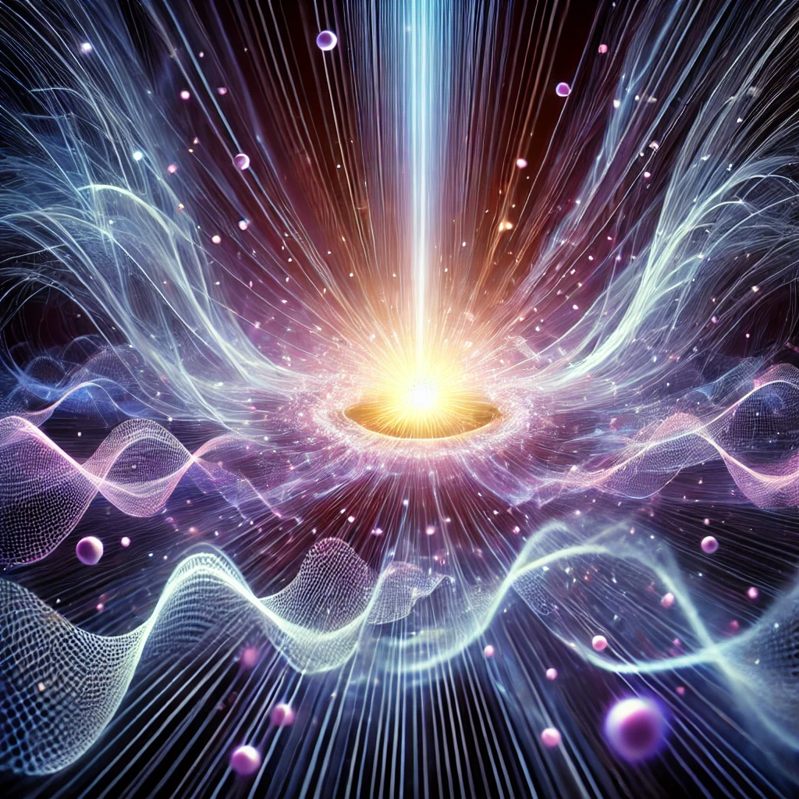

***

{width=66%}

# **3\. Protoinformation and Quantum Mechanics**

ISE introduces the concept of **protoinformation** — the pre-existent state of energy before it differentiates into space, time, or physical matter. Protoinformation underlies quantum mechanics, allowing for fluctuations that later manifest as observable particles and forces. According to this theory, protoinformation exists at all scales and is responsible for the emergence of quantum phenomena, such as wave-particle duality.

Additionally, ISE challenges the traditional view that quantum fields expand along with the universe. Instead, quantum fluctuations are viewed as fundamental to all scales and do not require spatial expansion. Thus, the quantum nature of reality is scale-independent, and macroscopic phenomena arise from these fluctuations, becoming observable as the universe differentiates.

**Protoinformation**

* **Definition and Role**: Protoinformation is the foundational, undifferentiated state of energy before it splits into observable quantities like space, time, and matter. It is not a defined entity but a relative state, dependent on the observer's scale. From a larger or smaller scale, what appears undifferentiated at one level can appear infinitely differentiated at another. This suggests a self-similar fractal-like structure at every level.  
* **Energy Differentiation**: Protoinformation differentiates energy into various states that eventually give rise to spacetime and matter. Unlike traditional theories where spacetime is a background entity, spacetime is emergent from this energy differentiation process.

**Quantum Fluctuations**

* **Quantum Fields and Expansion**: ISE posits that quantum fluctuations do not require spatial expansion, challenging the traditional model where quantum fields are thought to expand with the universe. Instead, quantum fluctuations are scale-independent, meaning they manifest across all scales, from microscopic to macroscopic, without needing the expansion of space.  
* **Wave-Particle Duality**: Quantum phenomena such as wave-particle duality are explained as emerging from protoinformation and the interaction between differentiated energy states. This underpins the observable behavior of quantum systems, where matter and energy exhibit both wave-like and particle-like properties depending on the interpretation.

**Quantum Fields and Relativity**

* **Quantum Fluctuations on Cosmic Scales**: ISE challenges the inflation model, arguing that quantum fields do not expand with space but exist independently. This implies that cosmic structures, like primordial density fluctuations, cannot be straightforwardly attributed to inflation stretching quantum fields.  
* **Scale-Dependence and Emergence**: One of the most radical aspects of ISE is its claim that what we perceive as large-scale structures in the universe (e.g., galaxies) are simply differentiated quantum states on a macroscopic level.

**Chapter Overview**

This chapter systematically develops the ISE reinterpretation of quantum mechanics, beginning with foundational concepts and progressing toward a unified spectral ontology. The argument proceeds through several interconnected stages:

**Foundations: From Protoinformation to Scale-Relative Quantization.** The chapter opens by establishing protoinformation as the undifferentiated substrate from which all observable quantities emerge. *The Relative Interpretation of Quantization, Scale-Free Reality, and Wave-Particle Duality* develops this relative interpretation, demonstrating that quantization, scale-free nature, and wave-particle duality are interconnected manifestations of energy differentiation at various scales. The scale-relational photonics section extends this analysis to electromagnetic quanta, reconciling wave descriptions with localized detection events through resolution-dependent energy accounting.

**Particles, Forces, and Spatial Structure.** *Elemental Particles as Spatial Information Distributions* reconceives elementary particles as spatial information distributions represented by potential vectors — non-spatial descriptors that encode mass, charge, spin, and interactions. This framework reinterprets gravitation as asymmetrical vector distribution, electromagnetism as vector reorganization, and the strong interaction as confinement without distance-defining vectors, dissolving the apparent emptiness of atoms into a rich informational architecture.

**The Nature of Light and Relativistic Limits.** *Be Light* develops a scale-centric reading of relativity that preserves all empirical predictions while reframing the speed of light from a universal dynamical limit to a local scale rate. Through four sub-sections — light's self-reference and blue shift, approaching $c$, scale freedom and constraints, and the infinite $c$ — it establishes proper time as the primitive observable and introduces an explicit scale-differentiation energy reservoir for global conservation.

**Determinism and the Dissolution of Quantum Randomness.** *Quantum Determinism and the Illusion of Randomness* challenges the orthodox assumption of fundamental randomness by reinterpreting decay processes as synchronization and resolution problems. The stability of halflives is identified as evidence for deterministic mechanisms, with apparent randomness emerging from the asynchronicity of interacting wave functions and the observer's limited resolution. *The Relational Nature of Quantum Uncertainty* complements this by formalizing quantum uncertainty as a relational phenomenon arising from the interaction between system and observer, deriving the Heisenberg uncertainty principle from proto-informational first principles rather than treating it as an irreducible limit.

**Mass, Inertia, and the Higgs Mechanism.** *The Higgs Mechanism as a Scaling Artifact* reinterprets the Higgs mechanism as a continuous scale differentiation rather than a spontaneous symmetry breaking, replacing metastability with gradual energy-level processes. *Inertia and Mass* extends this analysis, proposing that these properties emerge directly from a structure's relation to the scale hierarchy — with the Higgs field and mass formation being consequences rather than causes.

**Deconstruction of Unification Attempts.** *SUSY* undertakes a critical deconstruction of supersymmetry, Grand Unified Theories, and conventional unification programs. It exposes model-dependent assumptions behind coupling constant convergence and the hierarchy problem, ultimately reducing all physical structure to two fundamental principles — Information (electromagnetism as carrier) and Differentiation (gravitation as structural separation) — from which the strong and weak interactions emerge as specialized modifications.

**Toward a Unified Spectral Ontology.** The final chapters synthesize the preceding analyses into a coherent framework. *The Gradient-Wobble* introduces the gradient-wobble ontology, translating the familiar cast of atoms, particles, and fields into phases, frequencies, and polarization riding on gradients — providing an accessible bridge between classical pictures and ISE vocabulary. *Ultimate Utilitarianism* outlines the time-and-causality program: a framework that takes relational gradient patterns as sole primitives, with observation modeled as interference between wobbles and time emerging as projective appearance of ordered interference relations. *Quantum Wave Unification and Ontological Basis-Invariance* completes the arc by demonstrating that the apparent distinction between particle types can be reframed as resonance modes within a single continuous quantum wave, leading to the radical conclusion that all physical parameters — including dimensionality — are projection artifacts of proto-information, the sole ontological primitive.
