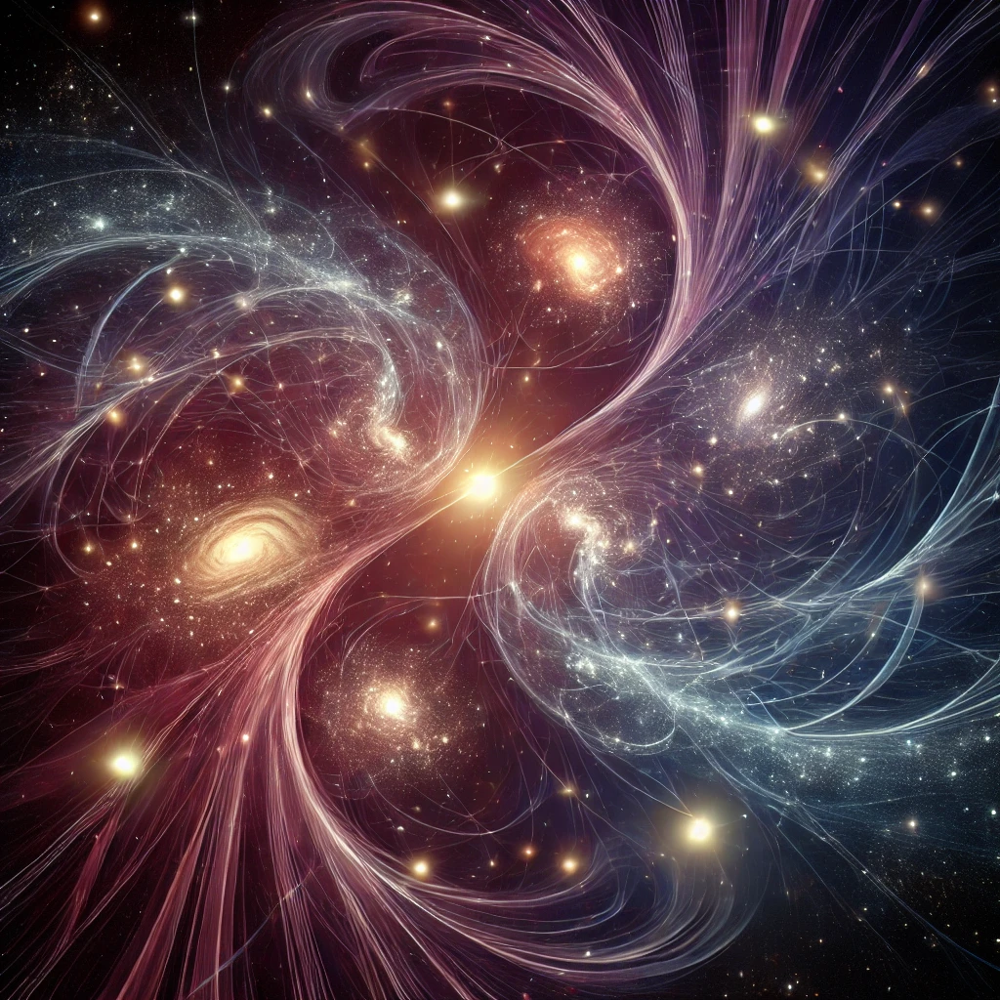

---

{width=66%}

# 5\. Unified Explanation of Cosmic Structures

The model rejects the necessity of singularities, such as those proposed in the Big Bang or black hole theories. Instead, it proposes that energy differentiates continuously without collapsing into singular points. Black holes are reinterpreted not as regions bound by a singularity but as areas where energy differentiation ceases, eliminating the need for singularity-driven physics. This challenges classical understandings and suggests the universe's evolution is a smooth, infinite process of energy flow, unbound by a specific starting point like the Big Bang.

**Key Points and Supporting Information:**

* **Gravitation Beyond Singularities:**  
  * In classical general relativity, gravitational effects near a singularity are seen as extreme, where space-time curvature reaches infinity. However, ISE suggests that gravity, as a property of space-time, continues to influence beyond a singularity. This challenges the view that singularities act as absolute endpoints. The concept of space-time geometry, as described by general relativity, remains valid even as energy differentiates across scales, eliminating the need for singular points like those found in black hole centers​​.  
* **Black Holes and White Holes:**  
  * Theoretical models speculate that singularities inside black holes may connect to other regions of space-time, potentially leading to "white holes" elsewhere. However, this remains speculative. ISE avoids such complications by removing the need for a singular collapse, instead seeing black holes as regions of stalled energy differentiation​​ but just in relation to our scale, the observer scale.  
* **Emergence and Differentiation:**  
  * ISE describes cosmic structures not as results of singular creation events but rather as emergent from the continuous process of energy differentiation. This process operates at all scales and does not require a Big Bang-like origin. Instead, it emphasizes that all structures, from galaxies to subatomic particles, are born out of this energy flow​​.  
* **Singularities and Observer Dependency:**  
  * Singularities, as traditionally understood, present breakdowns in the known laws of physics. However, under ISE, these are not absolute phenomena but observer-dependent. Singularities represent points where space-time or energy differentiation breaks down in one frame of reference but remain continuous in others. This leads to new interpretations of black hole physics, where traditional singularities are avoided​​.  
* **Quantum Scale and Cosmic Evolution:**  
  * Under ISE, the universe evolves continuously, without a specific point of origin. The Big Bang can be reinterpreted not as a beginning but as part of an infinite scale of differentiation. Black holes, similarly, do not collapse into singularities but represent areas of extreme energy flow where differentiation stalls​​.

This chapter unifies the explanations of cosmic structures, challenging the necessity of singularities and offering an alternate view where energy differentiates continuously. The implications touch on gravity, black hole physics, and the nature of time itself.
