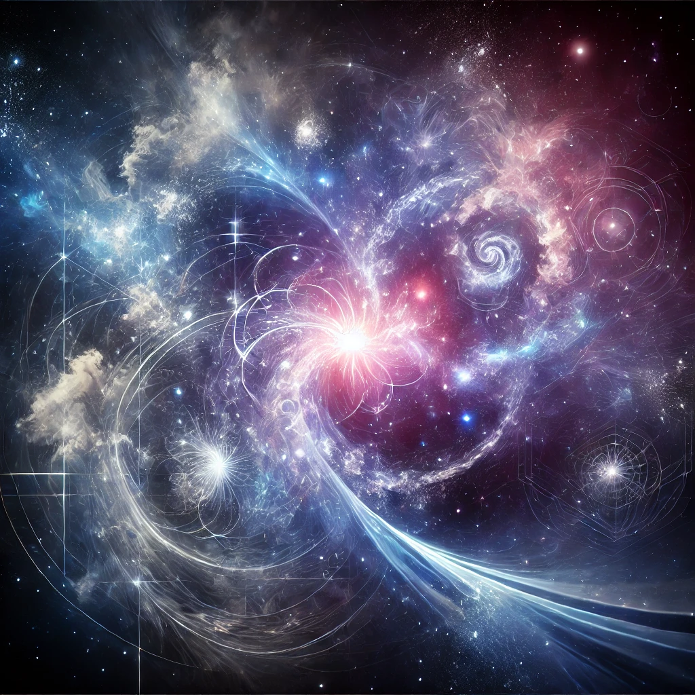

---

{width=66%}

# 6\. Philosophical Implications: The Nature of Reality

ISE has profound philosophical implications, particularly concerning the nature of reality. Since space and time are not fundamental properties but emergent from energy differentiations, the universe cannot be said to "exist" in the conventional sense. Rather, it is constantly evolving, and reality is relative to the observer's scale of perception.

The theory suggests that the complexity of the observable universe is a result of simple, recursive differentiation processes. This challenges traditional scientific goals of "understanding" the universe, as the very fabric of reality may be beyond comprehension, continually shifting as new energy states differentiate.

**Reality as a Relational Concept:**

ISE postulates that space and time are not fundamental but emergent properties derived from energy differentiation. This leads to the notion that the universe doesn't "exist" in a static sense but is instead in a constant state of evolution. Reality is thus viewed as relational and relative to the observer's scale of perception. The model suggests that our understanding of the universe may always be incomplete since reality continuously evolves and is deeply tied to how energy states differentiate across scales​​.

**Scale Differentiation and Emergence:**

In the model, **scale differentiation** plays a central role in the formation of observable structures, including time and space. The theory suggests that, through this differentiation, new scales emerge, and what we perceive as the fabric of reality (space, time, forces) are merely expressions of these energy divisions. At smaller or larger scales, reality may behave in ways that are entirely different from our everyday experience, implying that our perception is limited to specific energy ranges​​.

**Observer-Dependence and the Nature of Information:**

ISE challenges the notion of an objective, observer-independent reality. The nature of reality in this model is highly observer-dependent, as the observer’s interaction with different energy states defines the scale at which reality unfolds. The differentiation process is derived from **protoinformation**, which is the raw state before differentiation into recognizable properties. Information itself is seen as relative, and this leads to philosophical questions about whether absolute truths or realities exist at all​​.

**Minimalism and Instrumentalism in Physics:**

ISE supports a **minimalistic approach** in physics, where the focus is on describing observed effects without resorting to complex underlying models such as spacetime. Instead, the theory relies on observable phenomena, like energy fluctuations, to explain cosmic events. This approach shares similarities with **instrumentalism**, which suggests that theories are merely tools to predict observations rather than absolute descriptions of reality​​.

**Reality as a Continuous Process:**

The model proposes that the universe is a continuous flow of energy differentiation, without a defined beginning or end, such as those implied by the Big Bang. This continuous evolution of the universe brings into question the classical notions of **singularities** and **creation events**, suggesting instead that what we interpret as discrete events (like the Big Bang) are simply shifts in scale differentiation​​.

**Challenges in Defining Reality:**

Given that space, time, and forces like gravity are emergent, the very notion of "reality" becomes fluid. This leads to challenging philosophical questions, such as:

* **Is there an ultimate, objective reality**, or is it always relative to the observer's scale of perception?  
* **How do we define causality** in a universe where time is not fundamental but emergent from energy flows?  
* **Does space truly exist**, or is it merely a byproduct of differentiating energy levels? These challenges push the boundaries of traditional metaphysical and scientific inquiries​​.

**Implications for Causality and Emergence:**

ISE suggests that **causality** is an emergent property of energy differentiation. Time, which we often associate with causal events, emerges only when certain energy states are differentiated enough to create a sequence of interactions. This model redefines the arrow of time and challenges conventional ideas about how events are linked in the universe​​.

These insights present a profound challenge to traditional scientific models that treat time, space, and matter as fixed or inherent. The model instead promotes a vision of reality that is dynamic, observer-dependent, and forever in flux due to the constant flow of energy differentiation​​.
