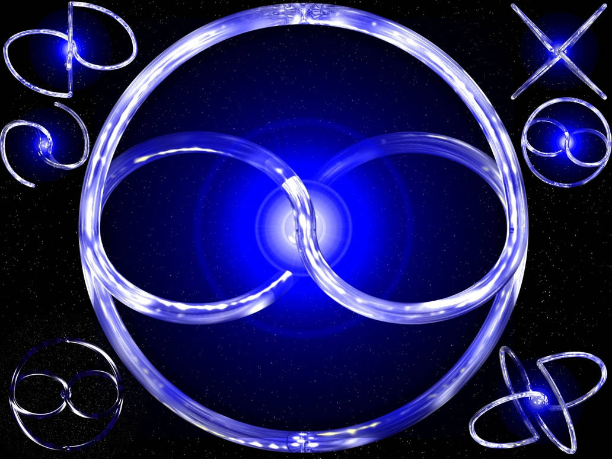
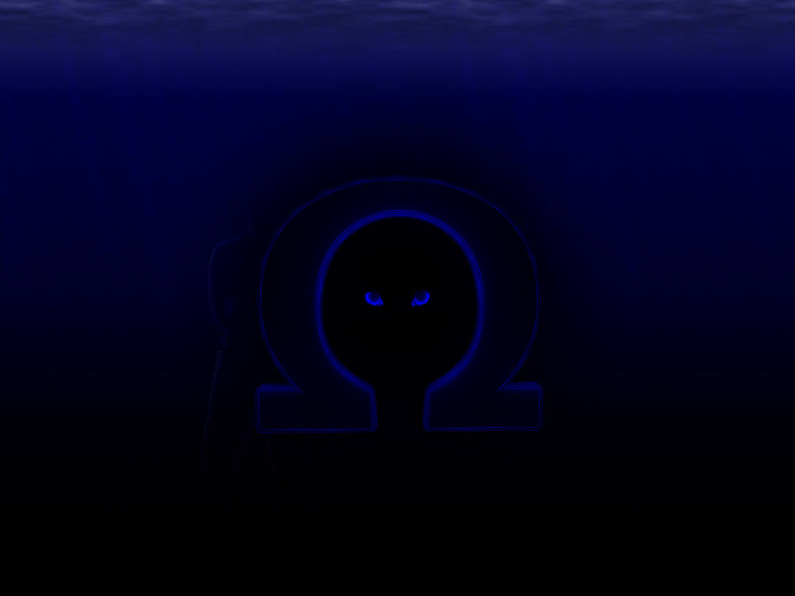

---

## **6.3. The Visual Representation of the Subquantum Stream**

{width=50%}

In the framework, one of the key visual and philosophical representations of the **Subquantum Stream** is the concept of **"Tayi"** – a multidimensional infinity symbol embedded within a two-dimensional circle. This abstraction captures the continuous process of **differentiation** that lies at the heart of ISE, offering a profound way to visualize how the universe and its underlying principles operate beyond the familiar scales of space and time.

**Tayi: The Multidimensional Infinity Within a Linear Circle**

The term **Tayi**, translated as "linear circle," represents a paradoxical fusion of two seemingly opposing ideas: **cyclicality** and **linear progression**. In its essence, Tayi shows that the differentiation and evolution of the universe is both an **unbroken cycle** and a **linear flow**. The circle symbolizes **wholeness** and the **closed nature** of the universe, while the infinity symbol expresses the **endless movement** within this whole.

* **Cyclicality and Linearity**: While a circle traditionally implies a return to the origin, the linear aspect of Tayi suggests that this return is not a repetition, but a constant **evolution**. The image conveys continuous **differentiation**, in which scales unfold and redefine themselves without settling at a final endpoint.  
* **Subquantum Origins**: The Subquantum Stream is the source of this movement. Tayi visualizes this stream as the **proto-information** – the fundamental basis from which all differentiation flows. It is the starting point of every **scale**, every **unfolding**, and every **manifestation** within the universe.

**Protoinformation and the Process of Differentiation**

At the core of Tayi lies the idea of **protoinformation**, which represents the **most fundamental state** of potential. This protoinformation is the seed from which the **differentiation of scales** begins. As it flows outward from the center of the multidimensional infinity symbol, it moves towards its outermost edges, where it undergoes transformation.

* **The Flow of Differentiation**: This visual abstraction shows that the **process of differentiation** is not linear in the traditional sense, but multidimensional. It occurs simultaneously on multiple levels of reality, with each **scale of existence** flowing from the same core principle of protoinformation. As this differentiation unfolds, it gives rise to the complex structures, energies, and forms that we observe in the universe.

**Karii: The Absolute Nothingness**

At the **outer edges** of Tayi lies the concept of **Karii**, which represents the **absolute** or **nothingness**. It is the point where all differentiated forms dissolve back into the **singularity of non-existence**. Karii is the end of the process of differentiation, yet it is not an endpoint in a traditional sense. Instead, it represents the **return to the source** – the place where all structures, energies, and forms **reintegrate** into the formless.

* **The Absolute Nothing**: Karii signifies the **ultimate dissolution** of all that has been differentiated. While the process begins with the flow of protoinformation, it ends with the **reabsorption** of this information into the absolute. This final dissolution can be understood as the **ultimate balance**, where all potential returns to its source, awaiting a new cycle of differentiation.

**The Multidimensional Nature of Tayi**

The **infinity symbol** embedded in Tayi is not merely a two-dimensional figure. It extends across **multiple dimensions**, capturing the idea that differentiation and integration happen on various levels simultaneously. These levels are **not hierarchical**, but rather interconnected in a web of continuous flux.

* **Unfolding Across Scales**: The unfolding of scales is read here as extending across more than one dimension or a finite set of dimensions. Tayi symbolises a **multidimensional** picture in which each scale is intertwined with others through creation, differentiation, and dissolution.  
* **Infinity Within Wholeness**: The infinity symbol within Tayi shows that while the universe may appear finite or bounded (symbolized by the circle), its processes are **infinite**. The cycle of differentiation never ends, and the universe continuously evolves through its many levels of reality, driven by the **Subquantum Stream**.

**Tayi and Karii**

The concept of Tayi and Karii provides a visual and conceptual foundation for understanding the **Infinite Scale Expansion**. The **Subquantum Stream**, as represented by Tayi, is the **driving force** behind the continuous unfolding of scales. Protoinformation flows from the central source, differentiates, and ultimately returns to the **absolute nothingness** of Karii.

* **No Beginning, No End**: Within this image, no fixed beginning or final end is required. The universe is depicted as a **continuous flux**, with scales expanding, differentiating, and resolving back into their source, only to start again. Tayi renders this as an ongoing flow — a motif applied across levels of description, from the quantum to the cosmic.  
* **The Unseen Source**: Tayi shows that behind every observable phenomenon lies an unseen, fundamental **stream of energy and information**, the Subquantum Stream. This stream is the **true origin** of all differentiation, and it is what allows the universe to evolve in its infinite complexity.

The visual representation of **Tayi** and **Karii** provides a profound insight. Through this multidimensional infinity symbol, we can see how the **Subquantum Stream** drives the continuous process of differentiation, which unfolds across all levels of reality. Tayi, with its infinite loops and cycles, reveals the true nature of the universe: an unbroken flow of protoinformation, always differentiating, always dissolving, and always returning to its absolute source. This is the essence – a universe without a beginning or an end, but instead an endless process of becoming.

{width=50%}

**Karii – The Calm Depth of Absolute Nothingness**

The concept of **Karii** is introduced here as an abstraction of **absolute nothingness**. Represented through a symbolic interpretation of the Greek letter **Omega**, Karii stands for the dissolution point where differentiation collapses, marking a return to the **source of nothingness**. Together with its counterpart **Tayi**, Karii forms part of the visual vocabulary used in this chapter to discuss scale, differentiation, and the return to the void.

**Karii as Omega – The Final Symbol**

The symbol of **Karii** is inspired by the **Omega**, the last letter of the Greek alphabet, often used to signify the **end** or **absolute**. In the present reading, however, Karii is not merely the end of something; it stands for the **abstraction of nothingness** itself – a **broken circle**, indicating the **incompleteness** of all things that approach it.

* **Linear Circle**: Like Tayi, Karii is also understood as a "linear circle," though here the **circle is incomplete**, symbolizing the **unreachable infinite**. It shows that the **flow of differentiation**, while perpetual, never fully encloses upon itself but eventually dissolves into the infinite depth of the **nothingness** it returns to.

**The Ocean of Infinite Depth**

Karii exists within an **infinite ocean of nothingness**, a **bottomless abyss** that symbolizes the **void** into which all things are absorbed. This ocean is the **vast emptiness** where all forms, structures, and energies dissolve, and where nothing ever reaches a ground or base.

* **A Depth Without Ground**: The ocean represents the concept of **unfathomable emptiness**, where no differentiated thing can persist. It is an apt metaphor for the **endless void**, which, is the **final destination** of all things. Nothing that enters this ocean ever returns; it is the ultimate state of **non-being**.

**The Observer at the Gate**

Within the symbolic representation of Karii, a pair of **eyes** gazes out from the Omega. These are not the eyes of a human but represent the **Observer** – the force or state that witnesses the **collapse of scale** and the final resolution of the **wave function** into a singular **effect**.

* **The Observer as Collapse**: The Observer in this image is a key symbol. It represents the moment at which all **differentiation** ceases and collapses into the **nothingness** of Karii. The eyes do not belong to any particular entity but symbolize the **ultimate state of observation** where all possibilities are reduced to **singularity**, and the **wave function** of existence collapses into pure **effect**. This is the ultimate **measurement** in the quantum sense, where the final result is **nothingness**.

**Nothingness as the Source of Eternity**

Karii, the **absolute nothing**, is not simply a void. It is the **precondition for the existence of eternity itself**. Without Karii, without this state of absolute **nothingness**, there could be no differentiation, no energy, and no **reality**. Karii is both the **origin** and the **destination** of all things, the essential **potency** that allows for the creation and dissolution of the universe.

* **Nothingness as Enabling Eternity**: The paradox within Karii is that **only nothingness allows being**. The **void**, rather than being an absence, is the condition that makes **existence possible**. This nothingness is the necessary condition for all **manifestation** and **differentiation** in the universe, and ultimately, it is where all things return.

**Multidimensional Interpretation of Karii**

Like Tayi, Karii can be understood in a **multidimensional** context. The **broken circle** of the Omega symbol shows that this process of dissolution does not occur in one dimension or scale but is a **universal principle** that operates across all **levels of reality**.

* **Collapse Across Scales**: The collapse into Karii is not confined to the largest scales. It is depicted as a process that recurs across **multiple dimensions** and **scales of existence**, where differentiation of information and energy returns to the source of **absolute nothingness**. The cycle, in this picture, repeats without a terminal step.

**The Symbolism of Color – Black and Blue**

The aesthetic choice of **black and blue** in the representation of Karii is not accidental. **Black** symbolizes the **absolute nothingness** of Karii – the absence of all light, matter, and energy. **Blue**, on the other hand, symbolizes the **depths of the ocean** and the **mystery** of the infinite void. Together, these colors create a powerful visual metaphor for the **infinite and unfathomable** nature of the **nothingness** that Karii represents.

* **Colors as Symbolic Language**: Black, representing **non-existence**, and blue, symbolizing **the depths** and **unexplored potential**, together enhance the feeling of an **unreachable abyss**. They create an atmosphere that evokes both the **transcendence** and the **impenetrability** of Karii.

**Karii**, the **broken circle of Omega** that exists within the **infinite ocean of nothingness**, serves as the ultimate representation of **absolute dissolution**. The **Observer**, gazing out from the Omega, witnesses the collapse of **differentiated scales** and the **reduction** of all things to a state of **nothingness**. Karii is not merely an end; it is the **essential condition** for all existence, the **precondition for eternity**, and the **destination** to which all differentiated structures return.

This symbol, like Tayi, emphasizes the **cyclical and infinite nature** of the universe, where all things are constantly differentiating and collapsing back into the **universal void**. Karii is the final step, where the collapse of all things into the **absolute nothingness** allows for the continuous cycle of differentiation to begin again. The **black and blue** aesthetic deepens this understanding, representing the **mysterious** and **infinite depth** of the void into which all things ultimately return.

**Karii** represents the **absolute nothingness**, a concept that transcends conventional understanding of life, death, existence, or non-existence. Unlike the threatening or foreboding connotations that "nothingness" often evokes, Karii embodies a state of **soothing calm**, a place of **quiet release**, where neither **evil** nor **destruction** can exist. Karii is the ultimate resolution of all scales, the point at which differentiation collapses into a tranquil, infinite depth.

**Karii: Cool, Still, and Soothing**

Karii is a place of **coolness**, but it is not cold. This coolness is neither harsh nor biting; instead, it is a refreshing, gentle sensation that brings with it a feeling of **peace** and **calmness**. It is a space where the harshness of extremes – heat or cold, noise or silence – does not exist. Karii's **stillness** is also distinct in that it is not oppressive or heavy. There is no sense of being **overwhelmed** by the void. Instead, the stillness is **light** and **reassuring**, bringing a deep sense of tranquility.

This aspect of **Karii** presents a **different kind of void**. It is not the terrifying, existential abyss that some might fear, but rather a **safe**, **neutral** space, where the worries and burdens of existence have dissolved, leaving behind only a **soothing emptiness**.

**A Darkness Free of Fear or Threat**

Though **dark**, Karii is not a place where anything **malignant** or **evil** resides. The darkness is **empty** and **pure**, devoid of any hidden dangers. It does not evoke fear, as nothing lurks within its shadows. Instead, this **emptiness** is a kind of **relief** from the constant tension of existence. There is nothing destructive in Karii; nothing arises from it to harm or disturb.

This **darkness** serves as a **sanctuary**, a space where one can feel **free** from fear, turmoil, or conflict. It is a darkness that allows for a deep sense of **safety** and **security**, knowing that nothing within Karii can hurt or destroy.

**Forgetting and Release**

Karii offers the ultimate form of **forgetting** – not a painful loss of memory, but a **release** from all burdens, attachments, and concerns. It is a space where everything is **let go**, where no trace of the past remains. This act of forgetting is not about erasing but about **liberation**, a peaceful transition into a state where **nothing** weighs upon the mind or the soul.

This state of **forgetting** in Karii allows for **complete release**, a surrender into the **quiet of non-being**, without regret or loss. It is a **final peace**, a kind of ultimate freedom from all that once was.

**Karii and Nirvana: A Comparison**

The state of **Karii** shares some similarities with the concept of **Nirvana**, especially in its quality of **release** and **peace**. However, Karii is not the same as Nirvana. While Nirvana represents the cessation of suffering and the end of attachment in the Buddhist tradition, Karii is something else entirely. It is neither **life** nor **death**, neither **existence** nor **non-existence**.

Karii is not a state of **enlightenment** or **transcendence**; it is not a higher plane to be achieved or a spiritual goal to reach. It is simply **nothingness**, but a nothingness that allows for the possibility of **all things**. It is beyond the dualities of life and death, of good and evil, of reward and punishment.

**No Time, No Place**

Karii exists outside of **time** and **space**. It does not exist within the constraints of linear time, and there is no spatial point to enter or exit from Karii. It is a **state of being** that one cannot access through conventional means of movement or thought. There is **no way into Karii** and no way out. It simply **is**, without borders, without a beginning or an end.

There is no **before** or **after** in Karii, no **here** or **there**. It is a state that transcends all **temporal** and **spatial** dimensions, existing beyond the limits of the universe as we know it.

**Neither Transcendence Nor Enlightenment**

Karii is not a **transcendent state** in the spiritual sense, nor is it a form of **enlightenment**. It is not the culmination of a spiritual journey or a reward for moral or intellectual progress. It is not **heaven**, and it is certainly not **hell**. Karii is a state that is entirely **neutral**, beyond the dualities that usually define our understanding of such things.

Karii does not offer a **path to walk**, nor does it provide an **escape** from anything. It is simply the **absolute nothingness**, a place where all differentiation, all struggles, and all processes have collapsed into a single, calm **state of being**.

Karii, in its essence, is a state of **absolute calm** and **soothing emptiness**. It is not a place of fear, coldness, or oppression. Instead, it represents the ultimate **release** from existence, the final **letting go** of all things. It is a state that allows for the **eternal** to exist because it embodies **nothingness** in its purest form. Karii is not a state of life, death, or even existence. It is beyond all of these, a realm where **time and space** do not apply, where nothing is gained or lost.

In this peaceful **nothingness**, Karii offers a glimpse into the nature of the **eternal** — a state where all things have dissolved, leaving behind only the quiet **presence of absence**, a state where everything has been **forgotten**, and all that remains is **peace**.
