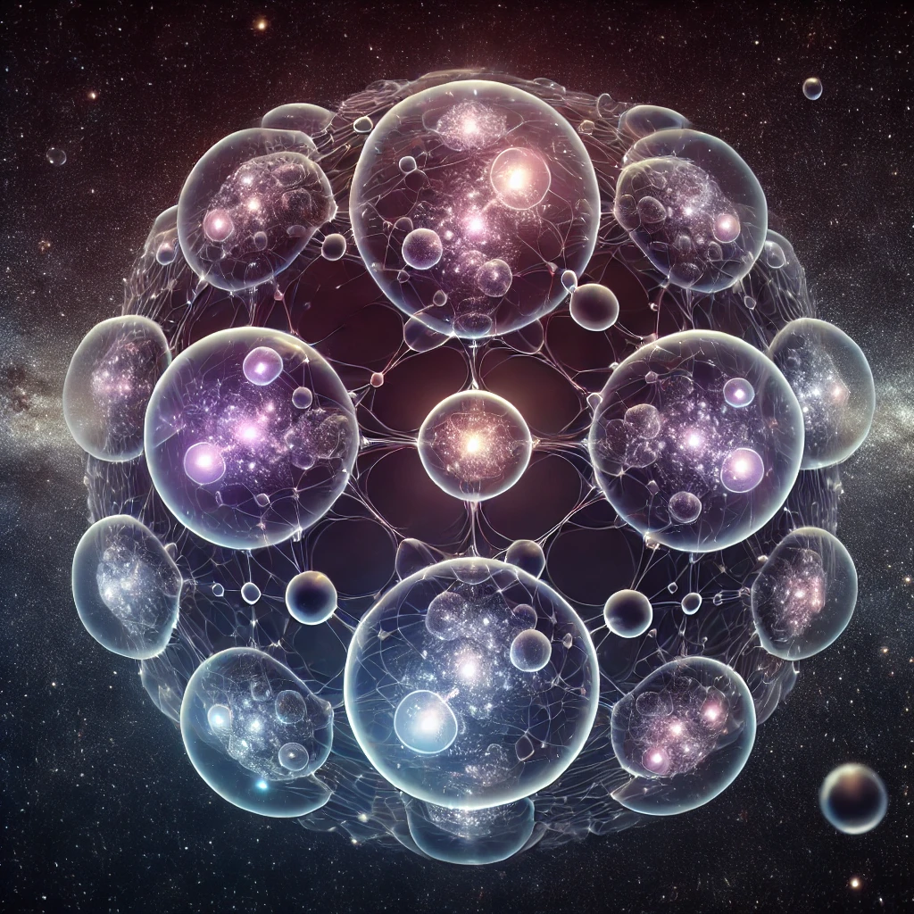

---

# 7\. The Multiverse Hypothesis

ISE naturally extends to a multiverse hypothesis, where each universe within the multiverse is simply another differentiated energy state. Our universe may be just one of many, existing within an infinite hierarchy of scales, where each level of reality appears as a "universe" or a quantum particle relative to its scale. This recursive view of reality eliminates the need for a single, overarching "universe" and allows for infinite variation across different scales.

ISE naturally extends to a **multiverse model** by suggesting that our universe is part of an infinite hierarchy of scales. Each "universe" is a differentiated state of potential energy, which exists on a particular scale, and each scale can represent an entire universe. This perspective blurs the boundary between what is considered a fundamental particle and what is a universe, depending on the observer's scale.

* **Hierarchical Scale Structure**:  
  * The **multiverse** is a hierarchical structure where each universe is an **elementary particle** of a larger scale. Conversely, each elementary particle in our universe could be a universe of a smaller scale​​. This also applies in analogy to a singularity.  
  * This recursive structure implies **self-similarity** across different scales. The same fundamental laws of physics could operate at various levels, though the manifestation of these laws would differ depending on the scale​​. The same fundamental laws in this context implies some sort of continuity but don’t excludes the possibility that fundamental forces are also and scale dependent interpretation.  
* **Cosmological and Philosophical Implications**:  
  * **Singularities and Black Holes**: In this model, black holes are considered gateways to other universes, with singularities representing highly differentiated states of energy. Each black hole could potentially lead to a new universe, reinforcing the idea of endless recursion and **universal birth via black holes**​.  
  * **Quantum Fluctuations**: ISE also ties the birth of universes to quantum fluctuations, suggesting that the energy from these fluctuations, when scaled down, results in what we observe as particle interactions. These fluctuations may cause new universes to emerge, analogous to **Big Bangs** in a multiverse setting​.  
* **Self-Similarity and Recursive Universes**:  
  * The multiverse within the model is inherently **recursive**, where each universe is nested within others. This **fractal nature** suggests that universes themselves are both **finite and infinite** in scale depending on the observer’s perspective​. This is very important to understand.  
  * The **time and energy density** in each universe is also scale-dependent. Larger universes experience time differently compared to smaller-scale universes, leading to the idea that **time and space are relative to scale**​​.  
* **Emergent Physics and Scale Variance**:  
  * ISE proposes that the **laws of physics** might be **scale-invariant** but manifest differently depending on the scale. This raises the question of whether the same quantum mechanical principles govern universes across scales, or if emergent phenomena appear due to the differentiation process​.  
* **Implications for the Observer**:  
  * The role of the observer is particularly important in ISE, as **perception of reality** is scale-dependent. Observers on different scales will perceive time, space, and matter differently, making the notion of "objective reality" relative​​.

**Conclusion:**

The **Multiverse Hypothesis** suggests a reality where universes exist within universes, recursively scaled both upward and downward. The challenge lies in understanding the nature of these scale transitions, the mechanism that governs their differentiation, and how this model can be empirically tested. The fractal, self-similar structure of the multiverse offers a new way of conceptualizing reality beyond traditional spacetime constraints.

**No Shared Continuity**

In the framework, discussing the multiverse as if other universes exist "alongside" or "separate" from our own is inherently meaningless and contradictory. This is because the model rejects the concept of a shared continuity between these supposed universes or scales. Here's a breakdown of why this approach makes multiverse theories, and even probabilistic interpretations of universes, problematic within ISE:

Each scale is its own self-contained system of differentiated potential energy, existing independently from other scales. The concept of "continuity" between different universes or realities implies some form of connection, overlap, or shared properties, which ISE outright rejects. Each scale in the universe evolves based on its own internal differentiations, without reference to or influence from others.

Thus, the idea of "another universe" is meaningless because:

* There is no continuum between them — no space, time, or energy shared across these supposed universes.  
* The emergence of a separate reality would mean it has no causal or relational connection to ours. Without any shared structure, the term *universe* itself loses its relevance, as it refers to the totality of existence, not isolated, unconnected domains.

**Absurdity of Scale Differences**

The model treats scales not as parallel or alternative dimensions but as different manifestations of energy differentiation. Each scale is essentially a different level of reality, but these levels do not overlap or interact in the way multiverse theories typically suggest. For instance:

* A "smaller" or "larger" scale is not an alternate universe but just another form of energy differentiating in its own context.  
* Referring to them as separate universes introduces the absurd idea that realities can coexist without interacting, which contradicts the ISE principle that only what differentiates within a particular scale can have any form of existence or relevance to that scale.

**Problems with Probabilistic Interpretations**

Probabilistic interpretations, such as those seen in the Many-Worlds Interpretation of quantum mechanics, propose the existence of multiple parallel outcomes branching into different universes. However, this idea is fundamentally at odds with ISE for several reasons:

* **No Real Existence of Probabilities**: Outcomes emerge from the continuous differentiation of energy. Probabilities do not *create* new universes or alternate realities; instead, they reflect the uncertainty within a single scale of differentiation. Once a state differentiates, it exists without any connection to unrealized possibilities.  
* **Emergence is Singular**: ISE focuses on the singular emergence of reality from energy differentiation, not on the simultaneous creation of multiple realities. Talking about other potential universes existing due to probabilistic outcomes is absurd because ISE doesn't allow for disconnected, unobservable realities.

**The Paradox of Unobservable Universes**

A major issue with multiverse models is the inability to observe or interact with other universes. Anything that is unobservable (whether it’s another universe or a different probabilistic outcome) has no real existence within the framework of our scale. Discussing such unobservable entities is therefore pointless, as they have no relevance to our understanding of the universe.

**Universes as Irrelevant Constructs**

Reality is defined strictly by energy differentiation at specific scales. The idea of "other universes," either in different scales or based on probabilistic outcomes, is rendered nonsensical because these hypothetical realities do not and cannot share continuity with our own. Without interaction or shared properties, talking about them is an exercise in absurdity. ISE thus eliminates the need for multiverse theories, focusing instead on the infinite process of differentiation within a single, scale-free quantum field.
