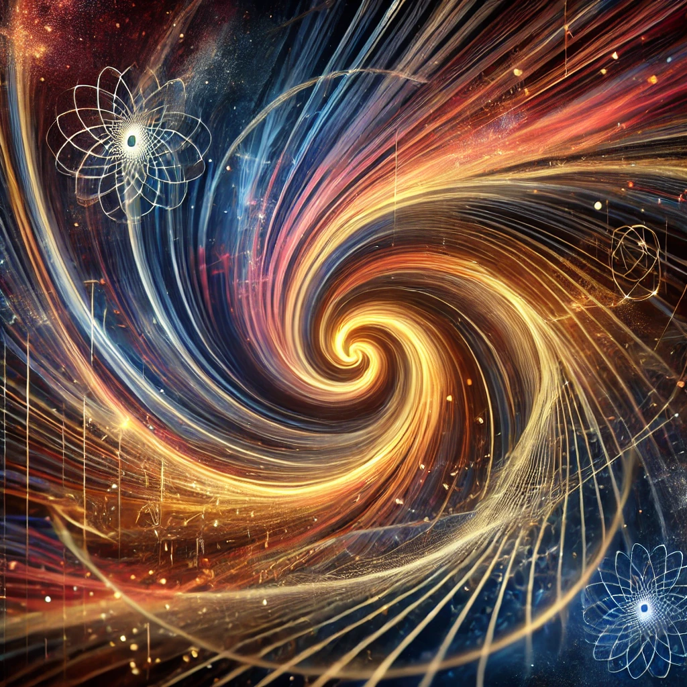

***

{width=66%}

# **8\. Causality, Time, and the Observer**

Causality here is treated as an outcome of relationships between differentiated energy states rather than as a primitive linear flow of time. The observer interacts with already differentiated states and perceives time as an emergent ordering of events. This reading is compatible with quantum-mechanical descriptions of measurement-driven wave-function collapse, reinterpreted as an interaction with scale-differentiated energy states rather than as a conscious act of measurement (interpretation).

**Causality:**

* Causality is taken to arise from the relationships between energy states as they differentiate within a scale-free quantum field, rather than from a linear temporal flow.
* Time is treated not as a fundamental dimension but as an emergent property reflecting the order of differentiated events (effects). Space, analogously, is defined by the separation of those effects. The experienced flow of time then reflects changes in potential energy across scales.

**The Role of the Observer:**

* The observer is not required to collapse reality into existence; instead, the observer interacts with already differentiated states, and time is perceived as a sequence of emergent events arising from interactions between energy states (interpretation).
* Compared with readings that require an observer for reality to exist (e.g., strong versions of the Copenhagen interpretation), the observer here participates by resolving pre-existing scale differentiations rather than producing them. This is closer in spirit to Block-Universe accounts.

**Time as Differentiation:**

* Time emerges from the differentiation of energy states. Rather than being constant, its local rate responds to scale changes: in regions of higher energy density, local time can appear to pass more slowly relative to lower-density regions (interpretation, consistent with gravitational time dilation in general relativity).
* On this reading, time is not universal but varies with the dynamics of energy differentiation. It is tied to how energy differentiates into observable states and how those states relate causally to one another.

**Philosophical Implications:**

* Treating time as an emergent rather than fundamental property allows a more dynamic relationship between cause and effect, and invites a reconsideration of causality at both quantum and cosmological scales (interpretation).
* Time remains relative within a single universe: observers in different regions can experience time differently due to varying local rates of differentiation, consistent with general relativity.

**Linear Expansion and Variable Time:**

* A significant idea presented is the notion that while the universe expands at a constant rate (linearly), time, or the speed of causality, could fluctuate. This creates a universe where time flows differently in various regions, even as the overall expansion remains constant. That is a constant differentiation relative perspective.

**Emergent Structures and Observer-Independent Reality:**

* ISE posits that reality is not dependent on the observer but exists through self-referential differentiation processes. Structures, such as galaxies or particles, emerge as the result of potential energy states interacting and differentiating at different scales.

This chapter outlines a reading of causality and time in which the observer interacts with differentiated energy states without determining the existence of reality itself.
