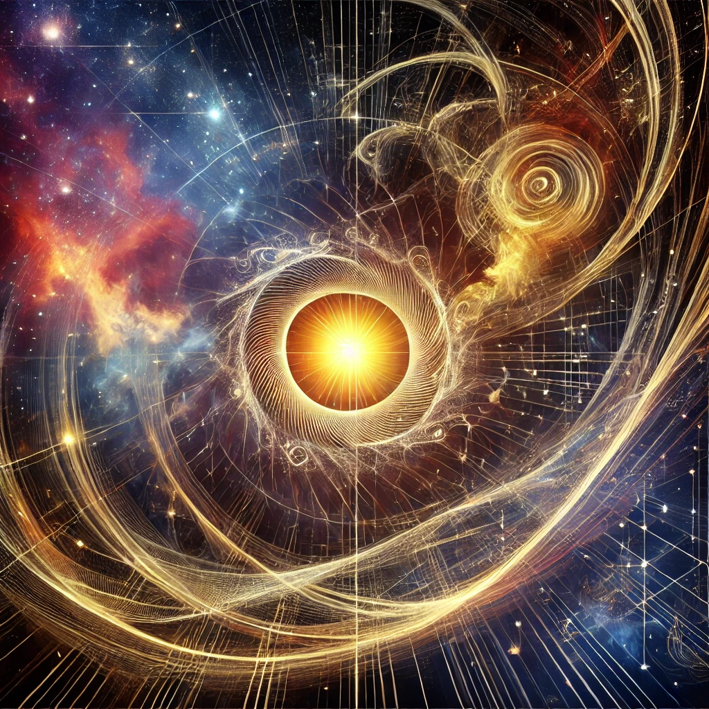

***

{width=66%}

# 9\. A Framework for Understanding Reality

The model acknowledges key observational phenomena like the **Cosmic Microwave Background (CMB)**, **primordial nucleosynthesis**, and the **redshift** of galaxies, but it critically questions their traditional interpretations and offers an alternative perspective.

**Cosmic Microwave Background (CMB)**

In standard cosmology, the CMB is seen as the afterglow of the Big Bang, a relic radiation from the early universe that provides strong evidence for a hot, dense beginning. The model accepts the existence of the CMB but challenges the idea that it necessarily represents the remnants of a Big Bang event. Instead, the ISE suggests that the CMB could be the outcome of differentiated energy states over vast cosmic scales. The homogeneity of the CMB might be explained not by inflation, but as a natural equilibrium resulting from continuous energy differentiation across scales.

**Primordial Nucleosynthesis**

Traditional cosmology ties primordial nucleosynthesis to the first few minutes after the Big Bang, when the temperatures and densities were just right for the formation of light elements like hydrogen, helium, and traces of lithium. The model recognizes the importance of these elements' relative abundances, but it questions the need for a "beginning" or a specific high-energy event like the Big Bang. Instead, ISE proposes that the formation of these elements could be a result of scale differentiation over time, without requiring the universe to pass through a singular, highly compact state.

**Redshift**

In the conventional model, redshift is interpreted as a direct consequence of the universe's expansion — light from distant galaxies stretches as space itself expands. The model acknowledges the redshift phenomenon but offers a different interpretation. Rather than being tied to spatial expansion, the redshift might result from the ongoing differentiation of energy states in the universe. This view decouples redshift from the need for an expanding universe, suggesting that the light is stretched due to changes in the energy states of the universe, not by the expansion of space itself.

In summary, while the model does not dismiss these key cosmological observations, it challenges the traditional interpretations tied to the Big Bang and offers an alternative framework based on continuous energy differentiation rather than a singular cosmic beginning.
