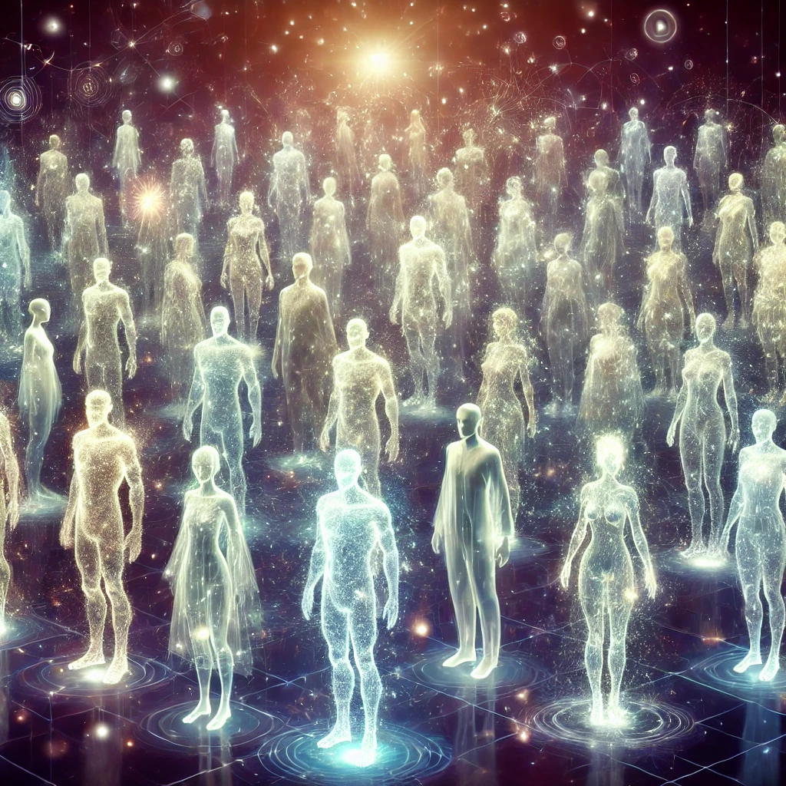

***

# **12\. Glossary of Key Terms**

1. **Infinite Scale Expansion**:  
  A framework that treats the universe as expanding through the continuous differentiation of energy. Within this reading, space, time, and gravity are interpreted as emergent properties of ongoing energy differentiation rather than as fundamental primitives.  
2. **Energy Differentiation**:  
  The process by which undifferentiated energy transforms into distinct states or structures, giving rise to phenomena like space, time, and physical forces. This process is ongoing and occurs across all scales.  
3. **Protoinformation**:  
  A concept referring to a pre-existing, undifferentiated state of energy that precedes space and time. Protoinformation is the source from which observable reality emerges through energy differentiation. It’s only a concept and not a part of any reality.   
4. **Quantum Fields**:  
  Fields that exist at the quantum level and govern the behavior of particles. Quantum fields are not tied to space or time but instead emerge through energy differentiation at various scales.  
5. **Emergent Properties**:  
  Characteristics or phenomena that arise from complex systems but are not inherent to the fundamental components of those systems. Space, time, and gravity are seen as emergent rather than fundamental properties.  
6. **Dark Energy**:  
  A mysterious form of energy thought to be responsible for the accelerated expansion of the universe. ISE reinterprets dark energy as an emergent feature of energy differentiation, rather than a separate force.  
7. **Dark Matter**:  
  An invisible form of matter that doesn't emit light but exerts gravitational influence on visible matter in the universe. ISE posits that dark matter emerges naturally from differences in potential energy, without the need for new particles.  
8. **Singularity**:  
  A point in space where physical quantities become infinite, such as in the center of a black hole or the Big Bang. Within ISE, singularities are read as scale-relative constructs depending on the frame of observation rather than as fundamental breakdowns of reality.  
9. **Fractal**:  
  A complex geometric structure that repeats itself at different scales. The universe is thought to have a fractal-like structure, where similar patterns and processes occur across various scales of differentiation.  
10. **Observer**:  
  In quantum mechanics and ISE, the observer plays a key role in determining the outcome of a system. The observer’s interaction with a system is believed to cause the collapse of quantum possibilities into a single observed reality.  
11. **Wave-Particle Duality**:  
  A concept in quantum mechanics where particles like photons and electrons exhibit both wave-like and particle-like properties, depending on the observer's method of measurement. ISE explains this duality as a scale-dependent phenomenon.  
12. **Multiverse Hypothesis**:  
  The idea that multiple universes exist, each potentially with different physical laws or constants. The multiverse is viewed as a set of differentiated states of energy, where universes emerge within an infinite hierarchy of scales.  
13. **Causality**:  
  The relationship between cause and effect. ISE reinterprets causality as an emergent property that arises from the relational order of energy states, rather than from linear time progression.  
14. **Space-Time**:  
  The four-dimensional continuum in which events take place, composed of three spatial dimensions and one temporal dimension. Space-time is seen as an emergent phenomenon resulting from energy differentiation, rather than a fundamental backdrop to the universe.  
15. **Gravity**:  
  A force that causes the attraction between masses. Gravity is not fundamental but arises from the differentiation of energy at large scales.  
16. **Quantum Fluctuations**:  
  Temporary changes in energy at the quantum level, which allow particles to briefly appear and disappear. ISE posits that these fluctuations are manifestations of protoinformation differentiating into observable forms.  
17. **Relativity**:  
  Refers to Einstein's theories (special and general) that describe how time, space, and gravity are relative to the observer’s frame of reference. ISE extends this idea, suggesting that space and time themselves are not fundamental but emergent from deeper energy processes and as thus also relative.  
18. **Planck Scale**:  
  The smallest scale of measurement in the universe, at which classical concepts of space and time break down, and quantum effects dominate. Below the Planck scale, space and time do not exist as we perceive them.  
19. **Entropy**:  
  A measure of disorder or randomness in a system. The increase in information due to continuous energy differentiation is analogous to the concept of increasing entropy.  
20. **Potential Energy**:  
    In classical physics, the energy stored in an object due to its position in a force field. Potential energy is the source from which space, time, and physical phenomena emerge through differentiation. As thus it’s better described as distance of effect delay and effect potential or speed.  
21. **Differentiated States**:  
    Refers to the distinct forms or configurations that energy can take as it splits and evolves. These states are the building blocks of observable reality in the framework.  
22. **Scale-Free Quantum Field**:  
    A quantum field that is not confined to any specific scale. Quantum fields operate across all scales, from the subatomic to the cosmic level, without being tied to traditional space-time constraints.  
23. **Observer Effect**:  
    A phenomenon where the act of observation influences the outcome of a quantum system. The observer is intrinsic to the collapse of possibilities into actual events, linking to the emergent nature of reality.  
24. **Temporal Expansion**:  
    The growth or emergence of time as a result of energy differentiation. Time itself is not constant but unfolds as energy states differentiate.  
25. **Macroscopic Structures**:  
    Large-scale objects or systems such as galaxies, stars, and planets. These structures are seen as emergent from microscopic quantum phenomena.  
26. **Quantum Mechanics**:  
    The branch of physics that deals with the behavior of particles on the smallest scales. ISE builds on quantum mechanics by explaining how quantum phenomena scale up to create the macroscopic universe.  
27. **Cosmic Microwave Background (CMB)**:  
    The remnant radiation from the early universe, often considered evidence of the Big Bang. The CMB is viewed as a relic of a previous state of cosmic differentiation rather than a singular beginning.  
28. **Holographic Principle**:  
    A concept in theoretical physics that suggests all information contained within a volume of space can be described by information on its boundary. This principle aligns with ISE’s idea that reality is a relational structure.  
29. **Inflation Theory**:  
    A theory that suggests the universe underwent rapid expansion immediately after the Big Bang. Within ISE, early-universe expansion is read as one phase of continuous energy differentiation, which offers a complementary reading of the features inflation is invoked to explain.  
30. **Quantum Entanglement**:  
    A phenomenon where particles become interconnected in such a way that the state of one immediately influences the state of another, no matter the distance. ISE explain entanglement as a result of deep, scale-free energy relationships.  
31. **Gravitational Lensing**:  
    The bending of light around massive objects due to the curvature of space-time. This effect can be explained through the differentiation of potential energy at large scales.  
32. **Multiscale Universe**:  
    The concept that the universe operates on many different scales simultaneously, from quantum to cosmic. ISE is based on the idea that processes of differentiation occur at all these scales, creating a unified reality.  
33. **Superposition**:  
    A principle in quantum mechanics where a particle exists in multiple states at once until it is observed. Superposition may be seen as undifferentiated potential before the observer collapses it into a singular state.  
34. **Non-Locality**:  
    The idea that particles can affect each other instantly, regardless of distance. This could be explained by the interconnected nature of differentiated energy across all scales.  
35. **Quantum Foam**:  
    A term used to describe the chaotic fluctuations of space-time at the Planck scale. This foam could be the result of protoinformation undergoing rapid differentiation.  
36. **Closed System**:  
    A system in which no energy or matter enters or leaves. Within ISE, the universe is read as an open system of continuous differentiation, so closed-system idealizations are treated as scale-limited approximations rather than as cosmological descriptions.  
37. **Symmetry Breaking**:  
    A process in physics where symmetrical states evolve into asymmetrical ones, leading to the formation of structures. Symmetry breaking could be a form of energy differentiation.  
38. **Spacetime Continuum**:  
    The four-dimensional framework that merges the three dimensions of space with time. ISE interprets the spacetime continuum as an emergent property rather than a fundamental one.  
39. **Relational Reality**:  
    The concept that reality is defined by the relationships between entities rather than by absolute properties. Space, time, and matter all emerge through relational differentiation of energy.  
40. **Information Theory**:  
    A field of study that deals with quantifying and interpreting information. Information is seen as the differentiation process itself, where energy splits into observable states.  
41. **Nonlinear Dynamics**:  
    A field of mathematics and physics dealing with systems where the output is not directly proportional to the input. The universe's expansion and energy differentiation may follow nonlinear patterns, leading to complex emergent behaviors.  
42. **Scalar Fields**:  
    A field in physics that associates a scalar value (a single number) with every point in space and time. ISE might use scalar fields to describe the continuous distribution of potential energy across different scales.  
43. **Thermodynamics**:  
    The study of energy and heat transfer. The concepts of thermodynamics may be reinterpreted to account for the flow and differentiation of energy across multiple scales.  
44. **Quantum Decoherence**:  
    The process by which quantum systems lose their superposition and behave classically when interacting with the environment. ISE may explain decoherence as a natural part of energy differentiation and the emergence of macroscopic reality.  
45. **Event Horizon**:  
    The boundary around a black hole beyond which nothing can escape. ISE might reinterpret event horizons as scale-dependent phenomena related to how energy differentiates in extreme conditions.  
46. **Cosmological Constant**:  
    A value representing the energy density of empty space (vacuum energy). ISE may view the cosmological constant not as a fixed quantity but as an emergent result of energy differentiation across cosmic scales.  
47. **Phase Transition**:  
    The transformation of a system from one state to another (e.g., from liquid to gas). Phase transitions could occur at both microscopic and macroscopic levels as energy differentiates into new states.  
48. **Quantum Gravity**:  
    A theoretical framework attempting to reconcile general relativity with quantum mechanics. ISE might contribute to this effort by offering a scale-free model of how gravity emerges from energy differentiation.  
49. **Big Bang Model**:  
    The prevailing cosmological theory of the universe's origin. Within ISE, the observed expansion is read as part of ongoing energy differentiation, which reframes the Big Bang as a scale-local transition rather than treating it as the sole origin event.  
50. **Higgs Field**:  
    A field responsible for giving particles mass through interaction with the Higgs boson. Mass might emerge as a result of energy differentiation rather than through interaction with a specific field.  
51. **Observer-Dependent Reality**:  
    A concept suggesting that reality is influenced by the observer’s frame of reference, particularly in quantum mechanics. Reality emerges through the interaction of observers with the differentiating energy fields.  
52. **Cosmic Web**:  
    The large-scale structure of the universe, where galaxies and galaxy clusters are interconnected by filaments of dark matter. ISE might interpret this structure as an emergent property of energy differentiating across vast cosmic scales.  
53. **Zero-Point Energy**:  
    The lowest possible energy that a quantum system can have, even at absolute zero. ISE could view zero-point energy as a fundamental aspect of protoinformation from which differentiation arises.  
54. **Black Hole Thermodynamics**:  
    A field studying the laws of thermodynamics as they apply to black holes. ISE might reinterpret black hole thermodynamics as manifestations of energy differentiation in extreme gravitational fields.  
55. **Supermassive Black Hole**:  
    A type of black hole with a mass millions to billions of times that of the Sun. The formation and growth of supermassive black holes might result from large-scale energy differentiations in galaxy centers.  
56. **Entropic Gravity**:  
    A theory proposing that gravity is an emergent phenomenon related to entropy and information. ISE could integrate this idea by explaining how gravity emerges from the flow of differentiated energy.  
57. **Dimensional Reduction**:  
    A hypothesis suggesting that at certain scales, dimensions of space may become irrelevant or collapse. ISE could support this idea by showing how different scales of energy differentiation result in emergent dimensions.  
58. **Baryonic Matter**:  
    Ordinary matter composed of protons, neutrons, and electrons. ISE might explore how baryonic matter emerges from energy differentiation at atomic and subatomic scales.  
59. **Quantum Field Theory (QFT)**:  
    A framework that combines quantum mechanics with special relativity to describe how particles interact. QFT may be an emergent feature of energy differentiation at quantum scales.  
60. **Fine-Tuning Problem**:  
    The question of why certain physical constants in the universe appear to be finely tuned to allow for the existence of life. ISE could offer a perspective where such constants emerge naturally from energy differentiation, reducing the need for fine-tuning.

{width=20%}
{width=20%}

Proudly present by us
